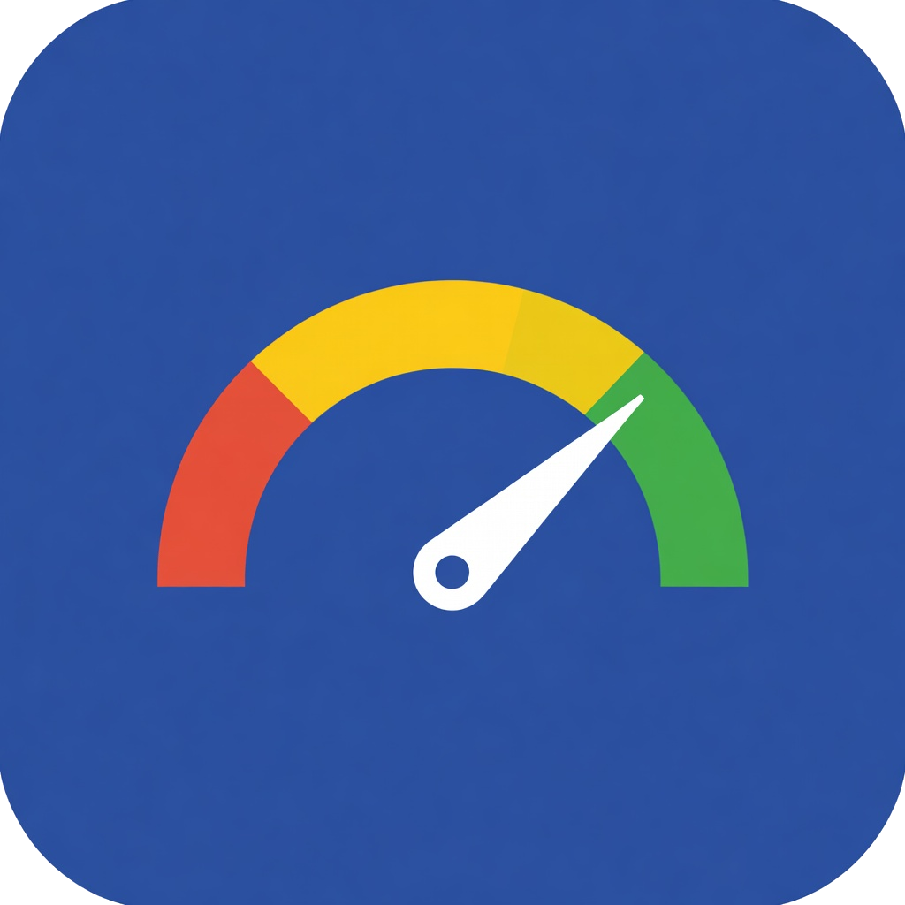

<p align="center">
  
</p>

# Attune

[](https://github.com/attune-io/attune/actions/workflows/ci.yaml)
[](https://github.com/attune-io/attune/actions/workflows/security.yaml)
[](https://goreportcard.com/report/github.com/attune-io/attune)
[](https://github.com/attune-io/attune/releases/latest)
[](go.mod)
[](LICENSE)
[](https://attune-io.github.io/attune/guides/fips-compliance/)
[](https://www.bestpractices.dev/projects/12998)
[](https://scorecard.dev/viewer/?uri=github.com/attune-io/attune)
[](https://operatorhub.io/operator/attune)
[](https://artifacthub.io/packages/helm/attune/attune)
[](https://hub.docker.com/r/attuneio/attune)
[](https://github.com/attune-io/attune/pkgs/container/attune)
[](https://krew.sigs.k8s.io/plugins/)

**Safe, in-place Kubernetes pod resource right-sizing. VPA done right.**

Attune is a Kubernetes operator that automatically right-sizes pod
resource requests and limits using [In-Place Pod Resize](https://kubernetes.io/blog/2025/12/19/kubernetes-v1-35-in-place-pod-resize-ga/)
(beta in Kubernetes 1.33+, alpha with feature gate in 1.32). In-place by default, optional eviction fallback for infeasible resizes, and no HPA conflicts.

---

## Why

| Problem | Impact |
|---------|--------|
| Average CPU utilization is **8%** | Billions wasted industry-wide ([CAST AI 2026](https://cast.ai/reports/state-of-kubernetes-optimization/)) |
| **70%** cite overprovisioning as #1 cost driver | Resources allocated "just in case" never reclaimed ([CNCF 2023](https://www.cncf.io/blog/2023/12/20/cncf-cloud-native-finops-cloud-financial-management-microsurvey/)) |
| **<1%** run VPA fully automated | VPA evicts pods, conflicts with HPA, causes outages ([ScaleOps 2026](https://scaleops.com/blog/why-pod-rightsizing-fails-in-production-a-deep-dive-into-vpa-and-what-actually-works/)) |
| In-Place Pod Resize is **beta** (K8s 1.33+, alpha in 1.32) | The foundation for non-disruptive right-sizing now exists |

## How It's Different

| | VPA | Goldilocks | Attune |
|---|---|---|---|
| Resize method | Evicts pods | No resize (recommend only) | **In-place** (no restarts) |
| HPA compatible | No (death spirals) | N/A | **Yes** (adjusts base, not %) |
| Safety | Minimal guardrails | N/A | **Graduated rollout + auto-revert** |
| Algorithm | Backward-looking histograms | VPA recommender | **Time-of-day-aware + burst detection** |
| Production confidence | <1% use automated | N/A | **Observe -> Recommend -> Canary (auto-promote) -> Auto** |

> **Migrating from VPA?** See the step-by-step [migration guide](docs/guides/migrating-from-vpa.md) for field-by-field mapping, side-by-side YAML, and zero-downtime cutover.

## Quick Start

### Prerequisites

- Kubernetes 1.32+ (1.32 requires enabling the `InPlacePodVerticalScaling` feature gate; 1.33+ has it enabled by default)
- Prometheus (for usage metrics)
- Helm 3.16+ or 4.x
- [cert-manager](https://cert-manager.io/docs/installation/) (for admission webhook TLS; to skip, install with `--set webhooks.enabled=false`)

**Optional GitOps export mode**: Recommendations can be written to ConfigMaps instead of (or in addition to) direct resizing. Ideal for ArgoCD/Flux workflows. See the [Auto mode guide](docs/guides/auto-mode.md#exporting-recommendations-to-configmaps).

### Install

```bash
helm install attune oci://ghcr.io/attune-io/charts/attune \
  --namespace attune-system --create-namespace
```

Also available via [OperatorHub.io](https://operatorhub.io/operator/attune)
(OLM) and raw manifests. See the
[Installation Guide](https://attune-io.github.io/attune/getting-started/installation/)
for all options.

### Create a Policy

Start in **Recommend** mode (safe, no changes applied):

```yaml
apiVersion: attune.io/v1alpha1
kind: AttunePolicy
metadata:
  name: api-services
  namespace: production
spec:
  targetRef:
    kind: Deployment
    selector:
      matchLabels:
        tier: api
  metricsSource:
    prometheus:
      address: http://prometheus-server.monitoring:80
  cpu:
    percentile: 95
    overhead: "20"
    minAllowed: "1m"
    maxAllowed: "4000m"
  memory:
    percentile: 99
    overhead: "30"
    minAllowed: "4Mi"
    maxAllowed: "8Gi"
  updateStrategy:
    type: Recommend
```

```bash
kubectl apply -f policy.yaml
```

### Check Recommendations

```bash
kubectl get attunepolicies -n production
# NAME            TYPE        WORKLOADS   RECS   RESIZED   READY   AGE
# api-services    Recommend   3           0      0         False   5m
```

After enough data accumulates, recommendations appear:

```bash
kubectl get attunepolicies -n production
# NAME            TYPE        WORKLOADS   RECS   RESIZED   READY   AGE
# api-services    Recommend   3           3      0         True    2d

kubectl attune recommendations -n production
# NAMESPACE   POLICY        WORKLOAD    CONTAINER  CPU REQ  CPU REC  MEM REQ  MEM REC  CONFIDENCE
# production  api-services  api-server  app        500m     320m     512Mi    384Mi    92.0%
# production  api-services  worker      main       1000m    480m     2Gi      1.2Gi    88.5%
# production  api-services  frontend    nginx      250m     120m     256Mi    180Mi    95.1%

kubectl attune savings -n production
# NAMESPACE   NAME          CPU SAVED  MEMORY SAVED  % SAVED  EST. MONTHLY
# production  api-services  830m       1012Mi        34%      $72.40
```

> **Note:** `minimumDataPoints` counts Prometheus range-query samples, not
> hours. With the default `queryStep: 5m`, `minimumDataPoints: 48` needs about
> 4 hours of data. If you increase `queryStep`, the wall-clock time rises too.
> See the [quickstart guide](docs/getting-started/quickstart.md) for details.
>
> **Effective defaults:** Most defaultable policy fields are applied by the
> controller at reconcile time so that `AttuneDefaults` and
> `AttuneNamespaceDefaults` can override them. Those fields may appear empty
> in `kubectl get attunepolicy -o yaml`, but the policy still follows the
> built-in and inherited runtime behavior unless you override those fields.
> Use `kubectl attune explain -n <namespace> <policy>` to inspect the
> effective values for the key controller-applied defaults and see whether each
> one came from the policy, a namespace default, a cluster default, or the
> built-in default.

> **Upgrading?** Review the [changelog](CHANGELOG.md) for breaking changes.
>
> **Helm installs:** If you use restrictive cluster networking, review the
> chart's [Helm README](charts/attune/README.md#networkpolicy)
> before installing with `networkPolicy.enabled=true` (the default). The
> policy allows webhook, metrics, DNS, API server, and Prometheus egress
> on `networkPolicy.prometheusPort` (default `9090`).

### Upgrade to Canary Mode

Once you trust the recommendations, switch to Canary mode to apply changes
to 10% of pods first:

```yaml
spec:
  updateStrategy:
    type: Canary
    canary:
      percentage: 10
      observationPeriod: 30m
    autoRevert: true
```

See the [examples/](examples/) directory for more scenarios: Auto mode,
HPA coexistence, cluster-wide defaults, and multi-workload selectors.

## kubectl Plugin

A `kubectl attune` plugin provides quick access to policy status,
savings, recommendations, resize history, and recommendation reasoning
without raw YAML parsing.

```bash
# Install via Krew (recommended)
kubectl krew install attune

# Or build from source
make build-plugin
sudo cp bin/kubectl-attune /usr/local/bin/

# Usage
kubectl attune status -n production
kubectl attune savings -n production
kubectl attune recommendations -n production
kubectl attune export -n production          # GitOps ConfigMap exports + last-updated
kubectl attune history -n production
kubectl attune explain -n production api-services

# All namespaces
kubectl attune status -A
```

Example output:

```
NAMESPACE   NAME          TYPE    WORKLOADS  RESIZED  READY       AGE
production  api-services  Canary  3          1        Monitoring  2d

NAMESPACE   POLICY        WORKLOAD    CONTAINER  CPU REQ  CPU REC  MEM REQ  MEM REC  CONFIDENCE
production  api-services  api-server  app        500m     320m     512Mi    384Mi    92.0%
```

## Grafana Dashboard

**Helm chart (recommended):** Enable `grafanaDashboard.enabled: true` in your
Helm values to auto-provision the dashboard via the Grafana sidecar:

```bash
helm upgrade attune oci://ghcr.io/attune-io/charts/attune \
  --set grafanaDashboard.enabled=true
```

**Manual import:** The raw JSON is at
[`deploy/grafana/dashboard.json`](deploy/grafana/dashboard.json). Import it
into Grafana and select your Prometheus data source.

The dashboard includes:
- Overview: total resizes, reverts, CPU/memory saved
- Resize Operations: resize rate by result, reverts by reason
- Recommendations: per-workload CPU/memory recommendations and confidence scores
- Operator Health: reconcile latency (p50/p99), Prometheus query duration, query errors

## Architecture

```
┌────────────────────────────────────────────────────┐
│                       attune                       │
│                                                    │
│  Policy         Metrics         Recommender        │
│  Controller ──► Collector ──►  Engine              │
│       │                     (percentile -> margin  │
│       │                      -> confidence ->      │
│       ▼                      bounds clamping)      │
│  Resize         Safety                             │
│  Engine ◄────► Monitor                             │
│  (/resize       (OOMKill, throttle,                │
│   subresource)   restarts, auto-revert)            │
└────────────────────────────────────────────────────┘
         │                    │
         ▼                    ▼
    Kubernetes API       Prometheus
    (Pod /resize)        (usage data)
```

## Features

### Safety

- Auto-revert: automatically restores original resources on OOMKill,
  CPU throttle, restart spikes, or pod NotReady.
- Graduated rollout: five modes from zero-risk to full automation --
  Observe, Recommend, OneShot, Canary, Auto.
- Node capacity guard: validates post-resize requests fit within node
  allocatable before applying changes.
- LimitRange/ResourceQuota guard: skips resizes that would violate
  namespace constraints or exceed quota headroom.
- Exponential backoff: cooldown doubles per consecutive revert
  (capped at 16x). Degraded condition flags workloads needing tuning.

### Intelligence

- Confidence scaling: conservative when data is sparse, precise as it
  accumulates. No premature optimization.
- Time-of-day awareness: hourly usage profiles ensure recommendations
  cover peak hours, not just the average.
- HPA coexistence: adjusts base resource requests without interfering
  with HPA's percentage-based scaling. No death spirals.
- Always-bounded: resource bounds (`minAllowed`/`maxAllowed`) per-policy with safe
  defaults (CPU: 1m-4000m, Memory: 4Mi-8Gi).

### Operations

- In-place resize: adjusts CPU and memory on running pods via the
  K8s 1.32+ `/resize` subresource. The default path is in-place with no
  restarts. `InPlaceOrRecreate` can optionally fall back to eviction when
  kubelet rejects an in-place resize.
- Cost savings estimation: per-workload `EstimatedMonthlySavings` in
  status, CLI (`kubectl attune savings`), and Grafana dashboard.
- Scheduled resize windows: restrict resizes to specific time windows
  and days of the week. Recommendations compute continuously regardless.
- Per-cycle budget caps: limit aggregate CPU/memory increases per
  reconcile cycle, preventing cluster-wide spikes.
- Concurrent pod processing: parallel pod resizes within a cycle for
  reduced latency at scale.

### Compatibility

- Multi-data-source: Thanos, VictoriaMetrics, Grafana Mimir, managed
  Prometheus. Bearer token auth, custom headers, TLS.
- Prometheus auto-discovery: finds Prometheus via the Operator CRD or
  well-known service names when no address is configured.
- Batch workloads: CronJobs and Jobs for recommend-only right-sizing.
- Namespace-scoped defaults: per-namespace `AttuneNamespaceDefaults`
  override cluster-scoped defaults for production vs staging.
- Conflict detection: warns about VPA, overlapping policies, or active
  rollouts targeting the same workload.
- VPA recommendation consumption: use existing VerticalPodAutoscaler
  recommendations as an alternative to Prometheus queries via `metricsSource.vpa`.
- SLO-based guardrails: PromQL-based application health checks
  (latency, error rate) that auto-revert resizes on threshold breach.
- GitOps diff command: `kubectl attune diff` outputs recommendations
  in diff format for ArgoCD/Flux review workflows.
- Initial sizing webhook: set pod resources at creation time based on
  existing policy recommendations, eliminating the "deploy with bad defaults" gap.
- Directional change caps: asymmetric `maxIncreasePercent`/`maxDecreasePercent`
  per resource (memory decreases are riskier than CPU increases).
- Memory-from-CPU derivation: `memoryFromCpuRatio` derives memory from CPU
  for JVM and heap-bound workloads.
- Pause reconciliation: `spec.paused: true` halts all activity without
  reverting existing resizes.
- Webhook warnings: 13 admission-time warnings for nonsensical config
  combinations with 31 runtime K8s events and per-policy suppression.

## Documentation

| Guide | Description |
|-------|-------------|
| [Why Attune?](docs/why-attune.md) | The problem, why VPA fails, and how in-place resize changes everything |
| [Savings Calculator](docs/savings-calculator.md) | Estimate your monthly savings with an interactive calculator |
| [Quickstart](docs/getting-started/quickstart.md) | Get running in 5 minutes |
| [First 30 Days](docs/getting-started/first-30-days.md) | Day-by-day guide from install to production Auto mode |
| [Migrating from VPA](docs/guides/migrating-from-vpa.md) | Step-by-step VPA replacement |
| [HPA Coexistence](docs/guides/hpa-coexistence.md) | Running alongside HPA |
| [Multi-Cluster](docs/guides/multi-cluster.md) | Deployment patterns, cross-cluster operations, and graduated rollouts |
| [Scaling Guide](docs/guides/scaling.md) | Cluster size presets, tuning, and HA deployment |
| [Canary Rollout](docs/guides/canary-rollout.md) | Graduated rollout strategy |
| [CLI Reference](docs/reference/cli.md) | kubectl plugin commands |
| [API Reference](docs/reference/api.md) | CRD specification |
| [Troubleshooting](docs/guides/troubleshooting.md) | Common issues and solutions |
| [Examples](examples/) | Ready-to-use policy manifests |
| [Contributing](CONTRIBUTING.md) | Development setup and guidelines |
| [Changelog](CHANGELOG.md) | Release history and breaking changes |
| [Adopters](ADOPTERS.md) | Organizations using Attune |

## License

Apache License 2.0. See [LICENSE](LICENSE) for details.
