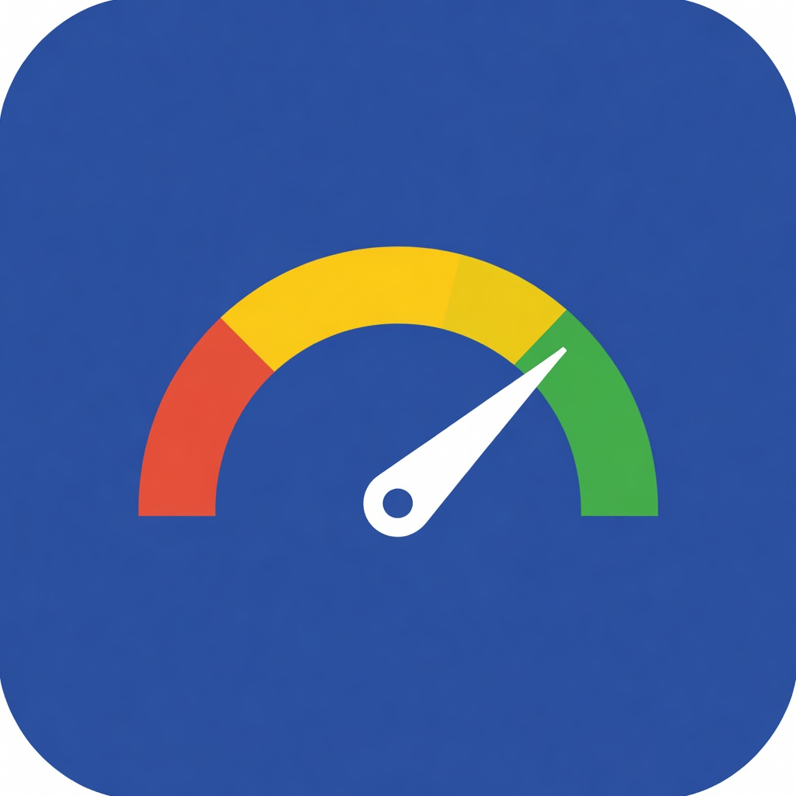

<p align="center">
  
</p>

# kube-rightsize

[](https://github.com/SebTardifLabs/kube-rightsize/actions/workflows/ci.yaml)
[](https://github.com/SebTardifLabs/kube-rightsize/actions/workflows/security.yaml)
[](go.mod)
[](LICENSE)

**Safe, in-place Kubernetes pod resource right-sizing. VPA done right.**

kube-rightsize is a Kubernetes operator that automatically right-sizes pod
resource requests and limits using [In-Place Pod Resize](https://kubernetes.io/blog/2025/12/19/kubernetes-v1-35-in-place-pod-resize-ga/)
(GA in Kubernetes 1.33+). In-place by default, optional eviction fallback for infeasible resizes, and no HPA conflicts.

---

## Why

| Problem | Impact |
|---------|--------|
| Average CPU utilization is **8%** | Billions wasted industry-wide (CAST AI 2026) |
| **70%** cite overprovisioning as #1 cost driver | Resources allocated "just in case" never reclaimed (CNCF 2023) |
| **<1%** run VPA fully automated | VPA evicts pods, conflicts with HPA, causes outages (ScaleOps 2026) |
| In-Place Pod Resize is **GA** (K8s 1.33+) | The foundation for non-disruptive right-sizing now exists |

## How It's Different

| | VPA | Goldilocks | kube-rightsize |
|---|---|---|---|
| Resize method | Evicts pods | No resize (recommend only) | **In-place** (no restarts) |
| HPA compatible | No (death spirals) | N/A | **Yes** (adjusts base, not %) |
| Safety | Minimal guardrails | N/A | **Graduated rollout + auto-revert** |
| Algorithm | Backward-looking histograms | VPA recommender | **Time-of-day-aware + burst detection** |
| Production confidence | <1% use automated | N/A | **Observe -> Recommend -> Canary (auto-promote) -> Auto** |

> **Migrating from VPA?** See the step-by-step [migration guide](docs/guides/migrating-from-vpa.md) for field-by-field mapping, side-by-side YAML, and zero-downtime cutover.

## Quick Start

### Prerequisites

- Kubernetes 1.33+ (In-Place Pod Resize GA)
- Prometheus (for usage metrics)
- Helm 3.16+ or 4.x
- [cert-manager](https://cert-manager.io/docs/installation/) (for admission webhook TLS; to skip, install with `--set webhooks.enabled=false`)

### Install

```bash
helm install kube-rightsize oci://ghcr.io/sebtardiflabs/charts/kube-rightsize \
  --namespace kube-rightsize-system --create-namespace
```

### Create a Policy

Start in **Recommend** mode (safe, no changes applied):

```yaml
apiVersion: rightsize.io/v1alpha1
kind: RightSizePolicy
metadata:
  name: api-services
  namespace: production
spec:
  targetRef:
    kind: Deployment
    selector:
      matchLabels:
        tier: api
  metricsSource:
    prometheus:
      address: http://prometheus-server.monitoring:80
  cpu:
    percentile: 95
    safetyMargin: "1.2"
    bounds:
      min: "50m"
      max: "4000m"
  memory:
    percentile: 99
    safetyMargin: "1.3"
    bounds:
      min: "64Mi"
      max: "8Gi"
  updateStrategy:
    mode: Recommend
```

```bash
kubectl apply -f policy.yaml
```

### Check Recommendations

```bash
kubectl get rightsizepolicies -n production
# NAME            MODE        WORKLOADS   RECS   RESIZED   READY   AGE
# api-services    Recommend   3           0      0         False   5m
```

After enough data accumulates, recommendations appear:

```bash
kubectl get rightsizepolicies -n production
# NAME            MODE        WORKLOADS   RECS   RESIZED   READY   AGE
# api-services    Recommend   3           3      0         True    2d

kubectl rightsize recommendations -n production
# NAMESPACE    POLICY         WORKLOAD     CONTAINER   CPU REQ   CPU REC   MEM REQ   MEM REC   CONFIDENCE / STATUS
# production   api-services   api-server   app         500m      320m      512Mi     384Mi     92.0%
# production   api-services   worker       main        1000m     480m      2Gi       1.2Gi     88.5%
# production   api-services   frontend     nginx       250m      120m      256Mi     180Mi     95.1%

kubectl rightsize savings -n production
# NAMESPACE    POLICY         CPU SAVED   MEM SAVED   EST. MONTHLY
# production   api-services   830m        1012Mi      $72.40
```

> **Note:** `minimumDataPoints` counts Prometheus range-query samples, not
> hours. With the default `queryStep: 5m`, `minimumDataPoints: 48` needs about
> 4 hours of data. If you increase `queryStep`, the wall-clock time rises too.
> See the [quickstart guide](docs/getting-started/quickstart.md) for details.
>
> **Effective defaults:** Most defaultable policy fields are applied by the
> controller at reconcile time so that `RightSizeDefaults` and
> `RightSizeNamespaceDefaults` can override them. Those fields may appear empty
> in `kubectl get rightsizepolicy -o yaml`, but they are still active. Use
> `kubectl rightsize explain <policy>` to inspect effective values.

> **Upgrading?** Review the [changelog](CHANGELOG.md) for breaking changes.
>
> **Helm installs:** If you use restrictive cluster networking, review the
> chart's [Helm README](charts/kube-rightsize/README.md#networkpolicy)
> before installing with `networkPolicy.enabled=true` (the default). The
> policy allows webhook, metrics, DNS, API server, and Prometheus egress
> on `networkPolicy.prometheusPort` (default `9090`).
### Upgrade to Canary Mode

Once you trust the recommendations, switch to Canary mode to apply changes
to 10% of pods first:

```yaml
spec:
  updateStrategy:
    mode: Canary
    canary:
      percentage: 10
      observationPeriod: 30m
    autoRevert: true
```

See the [examples/](examples/) directory for more scenarios: Auto mode,
HPA coexistence, cluster-wide defaults, and multi-workload selectors.

## kubectl Plugin

A `kubectl rightsize` plugin provides quick access to policy status,
savings, recommendations, resize history, and recommendation reasoning
without raw YAML parsing.

```bash
# Build the plugin
make build-plugin

# Copy to your PATH
sudo cp bin/kubectl-rightsize /usr/local/bin/

# Usage
kubectl rightsize status -n production
kubectl rightsize savings -n production
kubectl rightsize recommendations -n production
kubectl rightsize history -n production
kubectl rightsize explain api-services -n production

# All namespaces
kubectl rightsize status -A
```

Example output:

```
NAMESPACE    NAME           MODE      WORKLOADS   PENDING   RESIZED   READY        RESIZING   DEGRADED   AGE
production   api-services   Canary    3           2         1         Monitoring   -          -          2d

NAMESPACE    POLICY         WORKLOAD     CONTAINER   CPU REQ   CPU REC   MEM REQ   MEM REC   CONFIDENCE / STATUS
production   api-services   api-server   app         500m      320m      512Mi     384Mi     92.0%
```

## Grafana Dashboard

**Helm chart (recommended):** Enable `grafanaDashboard.enabled: true` in your
Helm values to auto-provision the dashboard via the Grafana sidecar:

```bash
helm upgrade kube-rightsize oci://ghcr.io/sebtardiflabs/charts/kube-rightsize \
  --set grafanaDashboard.enabled=true
```

**Manual import:** The raw JSON is at
[`deploy/grafana/dashboard.json`](deploy/grafana/dashboard.json). Import it
into Grafana and select your Prometheus data source.

The dashboard includes:
- **Overview**: total resizes, reverts, CPU/memory saved
- **Resize Operations**: resize rate by result, reverts by reason
- **Recommendations**: per-workload CPU/memory recommendations and confidence scores
- **Operator Health**: reconcile latency (p50/p99), Prometheus query duration, query errors

## Architecture

```
┌──────────────────────────────────────────────────┐
│                 kube-rightsize                     │
│                                                    │
│  Policy         Metrics         Recommender        │
│  Controller ──► Collector ──►  Engine              │
│       │                     (percentile -> margin  │
│       │                      -> confidence ->      │
│       ▼                      bounds clamping)      │
│  Resize         Safety                             │
│  Engine ◄────► Monitor                             │
│  (/resize       (OOMKill, throttle,                │
│   subresource)   restarts, auto-revert)            │
└──────────────────────────────────────────────────┘
         │                    │
         ▼                    ▼
    Kubernetes API       Prometheus
    (Pod /resize)        (usage data)
```

## Features

### Safety

- **Auto-revert**: Automatically restores original resources on OOMKill,
  CPU throttle, restart spikes, or pod NotReady.
- **Graduated rollout**: Five modes from zero-risk to full automation:
  Observe, Recommend, OneShot, Canary, Auto.
- **Node capacity guard**: Validates post-resize requests fit within node
  allocatable before applying changes.
- **LimitRange/ResourceQuota guard**: Skips resizes that would violate
  namespace constraints or exceed quota headroom.
- **Exponential backoff**: Cooldown doubles per consecutive revert
  (capped at 16x). Degraded condition flags workloads needing tuning.

### Intelligence

- **Confidence scaling**: Conservative when data is sparse, precise as it
  accumulates. No premature optimization.
- **Time-of-day awareness**: Hourly usage profiles ensure recommendations
  cover peak hours, not just the average.
- **HPA coexistence**: Adjusts base resource requests without interfering
  with HPA's percentage-based scaling. No death spirals.
- **Always-bounded**: Resource bounds (`min`/`max`) per-policy with safe
  defaults (CPU: 50m-4000m, Memory: 64Mi-8Gi).

### Operations

- **In-place resize**: Adjusts CPU and memory on running pods via the
  K8s 1.33+ `/resize` subresource. The default path is in-place with no
  restarts. `InPlaceOrEvict` can optionally fall back to eviction when
  kubelet rejects an in-place resize.
- **Cost savings estimation**: Per-workload `EstimatedMonthlySavings` in
  status, CLI (`kubectl rightsize savings`), and Grafana dashboard.
- **Scheduled resize windows**: Restrict resizes to specific time windows
  and days of the week. Recommendations compute continuously regardless.
- **Per-cycle budget caps**: Limit aggregate CPU/memory increases per
  reconcile cycle, preventing cluster-wide spikes.
- **Concurrent pod processing**: Parallel pod resizes within a cycle for
  reduced latency at scale.

### Compatibility

- **Multi-data-source**: Thanos, VictoriaMetrics, Grafana Mimir, managed
  Prometheus. Bearer token auth, custom headers, TLS.
- **Prometheus auto-discovery**: Finds Prometheus via the Operator CRD or
  well-known service names when no address is configured.
- **Batch workloads**: CronJobs and Jobs for recommend-only right-sizing.
- **Namespace-scoped defaults**: Per-namespace `RightSizeNamespaceDefaults`
  override cluster-scoped defaults for production vs staging.
- **Conflict detection**: Warns about VPA, overlapping policies, or active
  rollouts targeting the same workload.

## Documentation

| Guide | Description |
|-------|-------------|
| [Why kube-rightsize?](docs/why-kube-rightsize.md) | The problem, why VPA fails, and how in-place resize changes everything |
| [Savings Calculator](docs/savings-calculator.md) | Estimate your monthly savings with an interactive calculator |
| [Quickstart](docs/getting-started/quickstart.md) | Get running in 5 minutes |
| [Migrating from VPA](docs/guides/migrating-from-vpa.md) | Step-by-step VPA replacement |
| [HPA Coexistence](docs/guides/hpa-coexistence.md) | Running alongside HPA |
| [Scaling Guide](docs/guides/scaling.md) | Cluster size presets, tuning, and HA deployment |
| [Canary Rollout](docs/guides/canary-rollout.md) | Graduated rollout strategy |
| [CLI Reference](docs/reference/cli.md) | kubectl plugin commands |
| [API Reference](docs/reference/api.md) | CRD specification |
| [Troubleshooting](docs/guides/troubleshooting.md) | Common issues and solutions |
| [Examples](examples/) | Ready-to-use policy manifests |
| [Contributing](CONTRIBUTING.md) | Development setup and guidelines |
| [Changelog](CHANGELOG.md) | Release history and breaking changes |
| [Adopters](ADOPTERS.md) | Organizations using kube-rightsize |

## License

Apache License 2.0. See [LICENSE](LICENSE) for details.
