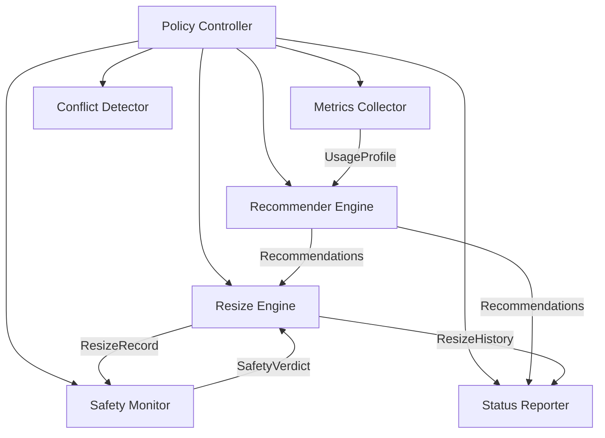
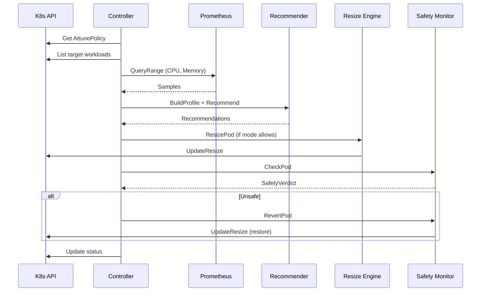

## High-level architecture

Attune is a single-binary Kubernetes operator built with
controller-runtime. It reconciles `AttunePolicy` custom resources and
coordinates six internal components:

## Components

### Policy Controller

The reconciler loop in `internal/controller/`. On each reconciliation:

1. Fetches the `AttunePolicy` CR.
2. Resolves one defaults source: `AttuneNamespaceDefaults` for the policy namespace if present, otherwise cluster-scoped `AttuneDefaults`.
3. Resolves the Prometheus address.
4. Discovers target workloads via name or label selector.
5. Checks for opt-out annotations and active rollouts.
6. Delegates to Metrics Collector, Recommender, and Resize Engine.
7. Updates status and requeues after the cooldown period.

### Metrics Collector

Located in `internal/metrics/`. Wraps the Prometheus HTTP API client and
provides two methods:

- **QueryRange**: executes a range query over the history window and returns
  raw `Sample` values (timestamp + float64).
- **Query**: executes an instant query for point-in-time values.

The collector queries `container_cpu_usage_seconds_total` (as a 5m rate) and
`container_memory_working_set_bytes`.

### Recommender Engine

Located in `internal/recommendation/`. Implements the
[estimator chain](algorithm.md) as a pipeline of composable `Estimator`
interfaces: Percentile, Margin, Burst, Confidence, Bounds, and Change Filter.

The engine accepts a `UsageProfile` (computed from Prometheus samples) and the
current resource allocation, and returns a recommended `resource.Quantity`.

### Resize Engine

Located in `internal/resize/`. Performs in-place pod resizes via the
Kubernetes `/resize` subresource (`UpdateResize` API). Key functions:

- **ResizePod**: deep-copies the pod, updates the target container's resources,
  and calls `UpdateResize`.
- **WaitForResize**: polls pod status until resources match the target or an
  `Infeasible` condition is detected.
- **IsEligibleForResize**: checks pod eligibility (running, not deleting,
  no active resize). Infeasible pods are eligible for eviction fallback.
- **IsResizeInfeasible**: detects pods the kubelet marked as unable to
  resize in-place on the current node.
- **EvictPod**: evicts a pod via the Eviction API (respects PDBs).
- **PreservesQoS**: ensures the resize does not change the pod's QoS class.

### Safety Monitor

Located in `internal/safety/`. Watches resized pods for degradation signals:

- OOMKill events after the resize timestamp.
- Restart count increases of 2 or more.
- Pod Ready condition going to `False`.

When a violation is detected, `RevertPod` restores the original resources via
`UpdateResize`. See [Safety System](safety.md) for details.

### Conflict Detector

Located in `internal/conflict/`. Detects potential conflicts:

- **HPA**: identifies HPAs targeting the same workload.
- **VPA**: warns about active VPA objects (future).
- **Opt-out**: checks for the `attune.io/skip: "true"` annotation.
- **Active rollout**: detects in-progress deployments.

### Status Reporter

Integrated into the Policy Controller. Updates the `.status` subresource with:

- Standard Kubernetes conditions (Ready, Resizing, Degraded).
- Per-workload recommendations with confidence scores.
- Aggregated savings estimates.
- Resize history (capped at 20 entries).

## Data flow

