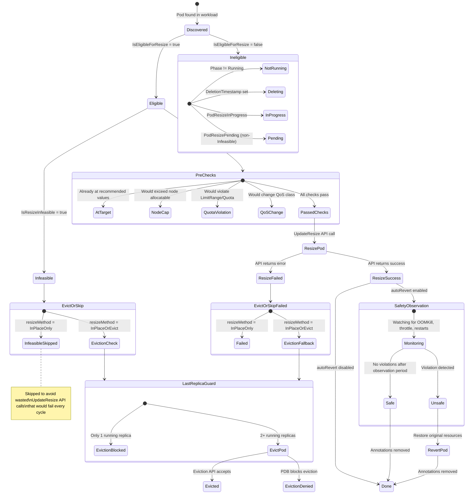

kube-rightsize uses the Kubernetes 1.33+ in-place pod resize API to adjust
container resources without restarting pods. This page explains how the
resize API works and how the operator uses it.

## The `/resize` subresource

Kubernetes 1.33 graduated `InPlacePodVerticalScaling` to GA. This adds a
`/resize` subresource on pods that accepts a modified `PodSpec` with new
container resource requests/limits.

```
PATCH /api/v1/namespaces/{ns}/pods/{name}/resize
```

The kubelet applies the new resources to the running container's cgroup
limits without restarting it. CPU changes take effect immediately; memory
limit increases take effect immediately but decreases only apply when the
container's working set drops below the new limit.

## How kube-rightsize uses it

The operator's resize engine (`internal/resize/engine.go`) performs
resizes via the typed Kubernetes client:

```go
clientset.CoreV1().Pods(namespace).UpdateResize(ctx, name, updatedPod, opts)
```

### Pre-checks before resize

Before calling `UpdateResize`, the controller runs several safety checks:

1. **Pod already at target**: Skips if the running pod's actual resources
   match the recommendation (compares against the live pod, not the
   Deployment template).
2. **Node capacity**: Verifies that total pod requests after resize don't
   exceed the node's allocatable resources.
3. **LimitRange/ResourceQuota**: Checks that the target doesn't violate
   namespace constraints.
4. **QoS preservation**: Ensures the resize won't change the pod's QoS
   class (e.g., from Guaranteed to Burstable).
5. **Resize policy warning**: If the container has `resizePolicy` set to
   `RestartContainer`, the operator logs a warning but proceeds with the
   resize (the kubelet will restart the container).

### Post-resize tracking

After a successful resize, the operator:

1. Writes tracking annotations to the pod (see table below).
2. If `autoRevert: true`, monitors the pod for safety violations (OOMKill,
   CPU throttle, restart spikes, NotReady).
3. Records the operation in `status.resizeHistory`.
4. Emits a Kubernetes Event (`Normal/Resized`).

### Pod tracking annotations

After a resize, the operator writes these annotations to the pod for safety
observation and revert tracking:

| Annotation | Description |
|---|---|
| `rightsize.io/resized-at` | RFC 3339 timestamp of the resize |
| `rightsize.io/resized-containers` | Comma-separated list of resized container names |
| `rightsize.io/resized-workload` | Name of the parent workload |
| `rightsize.io/original-cpu-request.<container>` | CPU request before the resize (per container) |
| `rightsize.io/original-memory-request.<container>` | Memory request before the resize (per container) |
| `rightsize.io/original-restart-count.<container>` | Container restart count at resize time (per container) |
| `rightsize.io/original-cpu-limit.<container>` | CPU limit before the resize (when limit is non-zero) |
| `rightsize.io/original-memory-limit.<container>` | Memory limit before the resize (when limit is non-zero) |
| `rightsize.io/policy` | Name of the RightSizePolicy managing this pod (used for safety observation provenance checks and finalizer cleanup) |
| `rightsize.io/startup-boost-at` | RFC 3339 timestamp when a startup CPU boost was applied |

These annotations are removed once the safety observation period completes
(regardless of whether the resize is kept or reverted). When a policy is
deleted, the `rightsize.io/cleanup` finalizer removes all tracking
annotations from managed pods before allowing garbage collection. Pods
keep their current (resized) resource values; only annotations are cleaned.

When multiple containers in the same pod are resized in the same cycle,
each container gets its own set of per-container annotations (e.g.,
`rightsize.io/original-cpu-request.app`, `rightsize.io/original-cpu-request.sidecar`).
The `rightsize.io/resized-containers` annotation lists all resized containers
as a comma-separated value.

## Resize lifecycle

The diagram below shows the complete decision tree for a single pod during
a resize cycle. The operator evaluates every pod in the workload through
this flow on each reconciliation.



### Decision points explained

| Decision | Function | Location |
|----------|----------|----------|
| **IsEligibleForResize** | `resize.IsEligibleForResize()` | `internal/resize/engine.go` |
| **IsResizeInfeasible** | `resize.IsResizeInfeasible()` | `internal/resize/engine.go` |
| **Pre-checks** | `shouldSkipResize()` | `internal/controller/rightsizepolicy_controller.go` |
| **Resize method** | `policy.Spec.UpdateStrategy.ResizeMethod` | CRD field |
| **Last replica guard** | `tryEvictionFallback()` | `internal/controller/rightsizepolicy_controller.go` |
| **ResizePod** | `resizer.ResizePod()` | `internal/resize/engine.go` |
| **Safety observation** | `checkPendingSafetyObservations()` | `internal/controller/rightsizepolicy_controller.go` |
| **Revert** | `safety.Monitor.RevertPod()` | `internal/safety/monitor.go` |

### Key behaviors

- **Infeasible pods are eligible.** `IsEligibleForResize` returns `true` for
  pods the kubelet has marked `PodResizePending=Infeasible`. These pods cannot
  be resized in-place on their current node, but they are included in the
  resize cycle so the eviction fallback can handle them when `resizeMethod`
  is `InPlaceOrEvict`. With `InPlaceOnly`, they are skipped with a log
  message ("Pod resize is Infeasible and resizeMethod is InPlaceOnly,
  skipping") to avoid wasting an UpdateResize API call that would fail
  on every reconcile cycle.

- **Eviction respects PDBs.** The operator uses the Kubernetes Eviction API
  (`EvictV1`), which enforces PodDisruptionBudgets. If the PDB would be
  violated, the eviction is denied and the pod stays as-is.

- **Last replica protection.** The operator never evicts the last running
  replica of a workload, even if the PDB would allow it. This prevents
  complete service outage during resize.

- **Eviction fallback restarts the pod from the current template.** When a pod
  is evicted, the workload controller (Deployment, StatefulSet) creates a
  replacement pod from the current PodTemplate. kube-rightsize does not patch
  workload templates as part of eviction fallback, so the replacement pod may
  come back with the original resources until a later in-place resize succeeds.
  Evicted pods are recorded separately from successful in-place resizes and do
  not enter the safety observation path.

- **Fail-open schedule.** If the configured timezone is invalid,
  `isWithinResizeWindow` returns `true` (allows resize) rather than silently
  blocking all resizes. Invalid timezones should be caught by webhook
  validation at admission time.

## Limits and caveats

- **Memory decreases**: The kernel only reclaims memory when the working
  set drops below the new limit. If the application holds onto allocated
  memory, the decrease has no practical effect until the process releases it.
- **Init containers**: Not resizable in-place. The operator only resizes
  regular containers.
- **Restart policy**: Containers with `resizePolicy: RestartContainer` will
  be restarted by the kubelet when their resources change.
- **Prometheus address limit**: The operator caches at most 64 unique
  Prometheus collector instances. If more than 64 distinct addresses are
  configured across all policies, additional addresses are rejected with
  an error status.
- **Minimum cooldown**: The operator enforces a minimum cooldown of 1 minute
  regardless of the `cooldown` field value. This prevents accidental DoS
  via rapid resize loops.