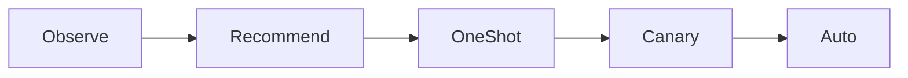
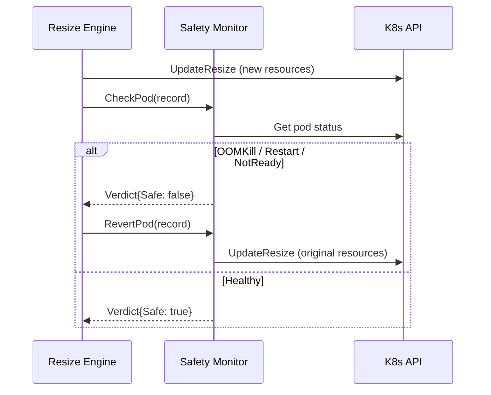

The safety system ensures that resource changes do not degrade application
health. It combines graduated rollout modes, automatic revert triggers, and
cooldown enforcement.

## Graduated rollout modes

The five modes provide increasing levels of automation:



| Mode | Risk | What happens |
|------|------|-------------|
| Recommend | None | Metrics collected, recommendations computed and written to status |
| OneShot | Low | One pod resized per cycle |
| Canary | Medium | Percentage-based rollout with observation |
| Auto | Higher | All eligible pods resized |

`Observe` collects metrics and tracks data-point progress but does not surface recommendations or savings. It serves as a zero-footprint warm-up before `Recommend`.

The recommended production path is Recommend, then Canary, then Auto.

## Auto-revert triggers

When `autoRevert: true` (the default), the safety monitor checks each
resized pod for the following conditions. Any match triggers an immediate
revert via `UpdateResize`:

### OOMKill

```go
if cs.LastTerminationState.Terminated.Reason == "OOMKilled" &&
   cs.LastTerminationState.Terminated.FinishedAt.After(record.ResizedAt)
```

The container was killed by the OOM killer after the resize. This indicates
the new memory allocation is too low.

**Mitigation**: increase `memory.overhead` or raise `memory.minAllowed`.

### Restart spike

```go
if cs.RestartCount >= record.RestartCount + 2
```

The container has restarted 2 or more times since the resize. This catches
crash loops that may be caused by insufficient resources.

**Mitigation**: check application logs for the root cause. The crash may
not be resource-related.

### CPU throttle

When a `ThrottleChecker` is configured (backed by Prometheus), the monitor
queries the CPU throttle ratio:

```
rate(container_cpu_cfs_throttled_periods_total[5m])
/ rate(container_cpu_cfs_periods_total[5m])
```

If the ratio exceeds 50% (configurable via `DefaultThrottleThreshold`), the
resize is reverted. A high throttle ratio after a CPU reduction means the
new allocation is too low.

!!! note "Throttle grace period"
    The throttle check is skipped for the first 5 minutes after a resize
    because the Prometheus `rate(...[5m])` window still contains pre-resize
    data. If the configured `safetyObservationPeriod` is shorter than 5 minutes,
    the operator automatically extends observation until the throttle check
    can execute. This prevents false-positive reverts on containers that
    were heavily throttled before upscaling.

**Mitigation**: increase `cpu.overhead` or raise `cpu.minAllowed`.

### Pod NotReady

```go
if condition.Type == PodReady && condition.Status != ConditionTrue
```

The pod's Ready condition is `False`, meaning readiness probes are failing.

**Mitigation**: verify that readiness probes are not sensitive to resource
allocation changes. Some applications expose health endpoints that degrade
under CPU throttling.

### SLO guardrails

After a resize, the safety monitor can evaluate application-level PromQL
queries to detect degradation. Each guardrail specifies a query, a
threshold, and a comparison direction (`above` or `below`).

The check runs only after the guardrail's `evaluationWindow` (default: 5m,
minimum: 1m) elapses post-resize. This delay gives the application time
to stabilize before comparing against SLO thresholds.

If a guardrail query breaches its threshold, the resize is reverted with
reason `slo:<guardrail-name>`. The monitor **fails open**: if a query
returns an error, NaN, or Inf, the guardrail is skipped with a log
message rather than triggering a false revert.

**Mitigation**: review the guardrail's PromQL query and threshold in
`updateStrategy.sloGuardrails`. Adjust the threshold, widen the
`evaluationWindow`, or remove the guardrail if the metric is unreliable.

## Observation period

After a resize, the operator observes the pod for a configurable period
before concluding the resize is safe. The observation period is configured
via `updateStrategy.safetyObservationPeriod` (default: 5m, minimum: 1m).

**Precedence**: `safetyObservationPeriod` > `canary.observationPeriod` > 5m default.
The `safetyObservationPeriod` field applies to all modes (Auto, OneShot, Canary)
while `canary.observationPeriod` is canary-specific.

### Early critical detection

During the observation period (before it elapses), the operator checks for
critical events that warrant an immediate revert without waiting for the full
period. Currently, two conditions trigger early detection:

- **OOMKill**: The container was killed by the OOM killer after the resize.
- **Excessive restarts**: The container restarted 2+ times since the resize.

Non-critical checks (CPU throttle, Pod NotReady) still wait for the full
observation period because they may be transient during resource adjustment.

## Exponential backoff

When consecutive resizes are reverted, the cooldown period is doubled per
consecutive revert (capped at 16x the base cooldown). This prevents the
operator from repeatedly resizing a workload that is failing:

| Consecutive reverts | Cooldown multiplier |
|---------------------|---------------------|
| 0 | 1x (base) |
| 1 | 2x |
| 2 | 4x |
| 3 | 8x |
| 4+ | 16x (cap) |

A successful resize resets the backoff to the base cooldown.

## LimitRange and ResourceQuota compatibility

Before executing a resize, the controller performs two checks:

1. **LimitRange**: Checks per-container min/max constraints. If the target
   CPU or memory request would fall below the minimum or exceed the maximum
   defined in any LimitRange in the namespace, the resize is skipped.

2. **ResourceQuota**: Checks aggregate namespace headroom. If the resize
   would increase CPU or memory requests beyond the remaining headroom
   (`hard - used`) in any ResourceQuota, the resize is skipped.

Both checks prevent resize failures that would produce confusing API errors.
Skipped resizes are logged but do not set error conditions.

## Kubernetes Events

The controller emits Kubernetes Events for visibility:

| Event type | Reason | When |
|-----------|--------|------|
| Normal | `Resized` | A container was successfully resized |
| Warning | `ResizeFailed` | The resize API call returned an error |
| Warning | `ResizeSkipped` | A resize was skipped (QoS change, node capacity, quota) |
| Warning | `Reverted` | A resize was reverted due to a safety violation |

Events are visible via `kubectl describe attunepolicy` and
`kubectl get events`.

## Degraded condition

When 3 or more of the last 5 resize operations are reverted, the controller
sets a `Degraded` condition with reason `HighRevertRate`. This signals that
the policy's parameters need adjustment before further resizes should be
attempted.

## Revert mechanics

When a safety violation is detected:

1. The monitor calls `RevertPod()`, which deep-copies the pod and sets the
   container resources back to the original values from the `ResizeRecord`.
2. The revert uses `UpdateResize` (the same in-place mechanism), so no pod
   restart occurs.
3. The resize history entry is updated to `result: Reverted`.
4. The `attune_reverts_total` counter is incremented with the
   violation reason as a label.



## Cooldown enforcement

After any resize operation (successful or reverted), the operator records the
timestamp in the `attune.io/last-resize-time` annotation. On the next
reconciliation, it checks:

```go
if time.Since(lastResizeTime) < cooldown {
    // skip resize, requeue after remaining cooldown
}
```

The default cooldown is 1 hour. This prevents rapid-fire resizes that could
destabilize workloads.

## Node capacity pre-check

Before submitting a resize, the controller sums all container requests in the
pod (applying the new target for the container being resized) and compares the
total against the node's allocatable resources:

```go
if totalCPU > allocCPU || totalMem > allocMem {
    // skip resize for this container
}
```

This prevents resizes that would exceed the node's capacity and cause eviction.
The check is per-pod, not per-node, so it does not account for other pods on the
same node. If the node lookup fails (e.g., node not found), the resize proceeds
without the check.

## Container exclusion

Well-known mesh and sidecar names are auto-excluded by default
(`excludeKnownSidecars: true`). The `excludedContainers` field adds more
names to skip (union with the known list), for custom agents beyond
built-in names such as `istio-proxy` or `linkerd-proxy`
from both recommendations and resizes. Excluded containers are not queried for
metrics and are not considered for resize.

## Conflict detection

Before resizing, the controller checks for potential conflicts:

- **Active rollout**: if `UpdatedReplicas < Replicas`, the workload is
  mid-rollout and resizing is deferred.
- **Opt-out annotation**: workloads with `attune.io/skip: "true"` are
  skipped entirely.
- **QoS preservation**: for Guaranteed-class pods, the resize is blocked if
  it would cause requests to differ from limits.
- **HPA coexistence**: an informational notice is logged but resizing proceeds.
  See [HPA Coexistence](../guides/hpa-coexistence.md).

## High revert rate

When multiple consecutive resizes are reverted (visible in
`.status.resizeHistory`), the policy's parameters likely need adjustment
before further resizes should be attempted. Check the revert reasons
(`oomkill`, `restart`, `notready`, `throttle`, `slo:<name>`) and adjust overheads or cooldown
accordingly.
