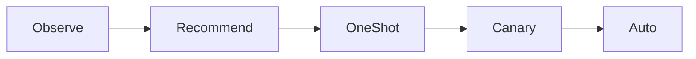
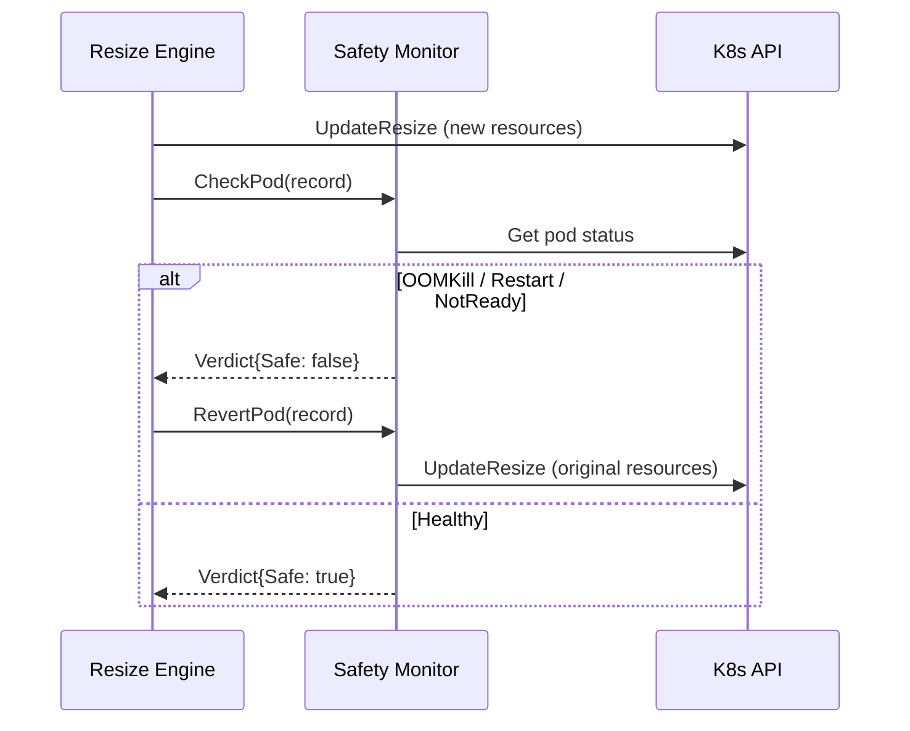

The safety system ensures that resource changes do not degrade application
health. It combines graduated rollout modes, automatic revert triggers, and
cooldown enforcement.

## Graduated rollout modes

The five modes provide increasing levels of automation:



| Mode | Risk | What happens |
|------|------|-------------|
| Observe | None | Metrics collected, no output |
| Recommend | None | Recommendations written to status |
| OneShot | Low | One pod resized per cycle |
| Canary | Medium | Percentage-based rollout with observation |
| Auto | Higher | All eligible pods resized |

The recommended production path is Recommend, then Canary, then Auto.

## Auto-revert triggers

When `autoRevert: true` (the default), the safety monitor checks each
resized pod for the following conditions. Any match triggers an immediate
revert via `UpdateResize`:

### OOMKill

```go
if cs.LastTerminationState.Terminated.Reason == "OOMKilled" &&
   cs.LastTerminationState.Terminated.FinishedAt.After(record.ResizedAt)
```

The container was killed by the OOM killer after the resize. This indicates
the new memory allocation is too low.

**Mitigation**: increase `memory.safetyMargin` or raise `memory.bounds.min`.

### Restart spike

```go
if cs.RestartCount >= record.RestartCount + 2
```

The container has restarted 2 or more times since the resize. This catches
crash loops that may be caused by insufficient resources.

**Mitigation**: check application logs for the root cause. The crash may
not be resource-related.

### Pod NotReady

```go
if condition.Type == PodReady && condition.Status != ConditionTrue
```

The pod's Ready condition is `False`, meaning readiness probes are failing.

**Mitigation**: verify that readiness probes are not sensitive to resource
allocation changes. Some applications expose health endpoints that degrade
under CPU throttling.

## Revert mechanics

When a safety violation is detected:

1. The monitor calls `RevertPod()`, which deep-copies the pod and sets the
   container resources back to the original values from the `ResizeRecord`.
2. The revert uses `UpdateResize` (the same in-place mechanism), so no pod
   restart occurs.
3. The resize history entry is updated to `result: Reverted`.
4. The `kube_rightsize_reverts_total` counter is incremented with the
   violation reason as a label.



## Cooldown enforcement

After any resize operation (successful or reverted), the operator records the
timestamp in the `rightsize.io/last-resize-time` annotation. On the next
reconciliation, it checks:

```go
if time.Since(lastResizeTime) < cooldown {
    // skip resize, requeue after remaining cooldown
}
```

The default cooldown is 1 hour. This prevents rapid-fire resizes that could
destabilize workloads.

## Conflict detection

Before resizing, the controller checks for potential conflicts:

- **Active rollout**: if `UpdatedReplicas < Replicas`, the workload is
  mid-rollout and resizing is deferred.
- **Opt-out annotation**: workloads with `rightsize.io/skip: "true"` are
  skipped entirely.
- **QoS preservation**: for Guaranteed-class pods, the resize is blocked if
  it would cause requests to differ from limits.
- **HPA coexistence**: an informational notice is logged but resizing proceeds.
  See [HPA Coexistence](../guides/hpa-coexistence.md).

## Degraded condition

When the revert rate is too high, the controller sets a `Degraded` condition
with reason `HighRevertRate`. This signals that the policy's parameters need
adjustment before further resizes should be attempted.
