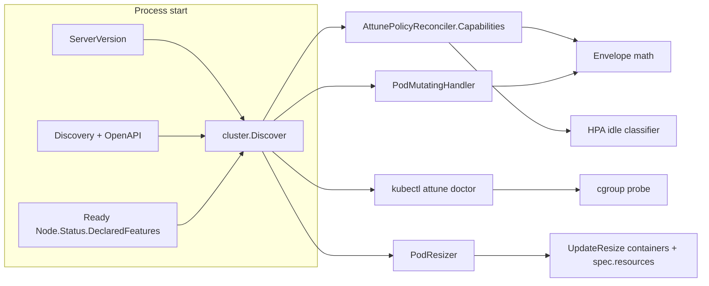
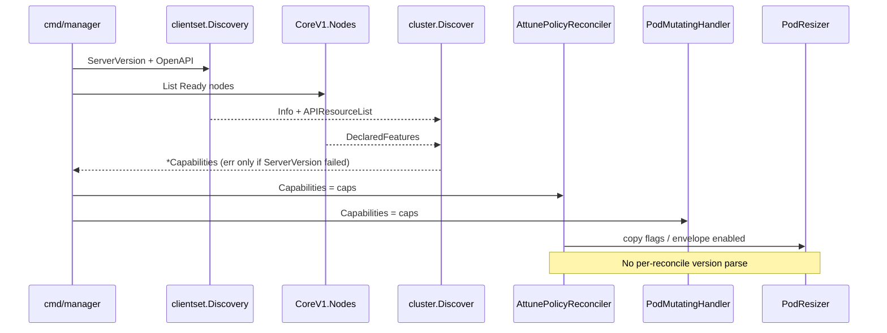
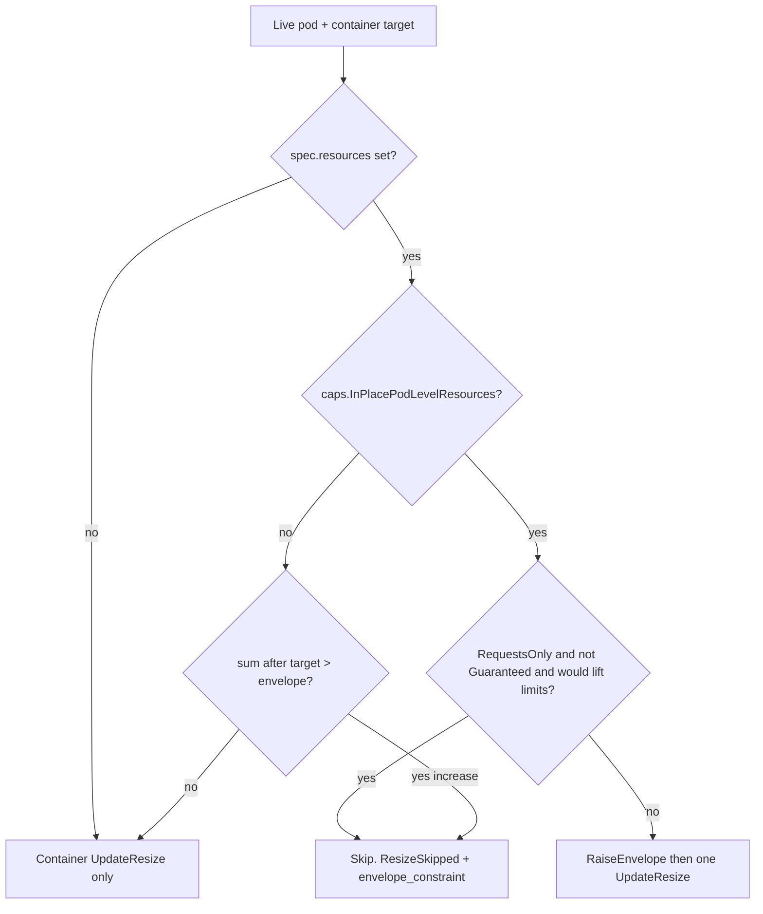
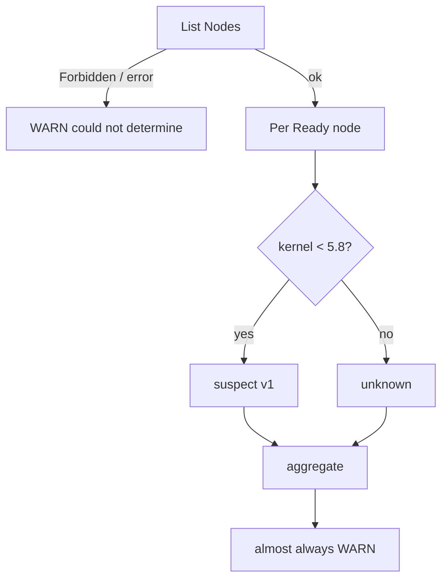

| Field | Value |
|-------|-------|
| Status | Landed |
| Author | Attune maintainers |
| Date | 2026-09-14 |
| Audience | Attune maintainers and reviewers |
| Related | `internal/resize/engine.go`, `cmd/manager/main.go`, `cmd/kubectl-attune/doctor.go`, `internal/conflict/detector.go`, `internal/webhook/pod_mutating.go`, `internal/controller/template_persistence.go`, `.github/workflows/e2e-nightly.yaml` |

This page is the version-best Kubernetes design. The series landed on
main as [#751](https://github.com/attune-io/attune/pull/751) (matrix),
[#758](https://github.com/attune-io/attune/pull/758) (capabilities),
[#760](https://github.com/attune-io/attune/pull/760) (ResizeUnchanged),
[#761](https://github.com/attune-io/attune/pull/761) (doctor cgroup),
[#762](https://github.com/attune-io/attune/pull/762) (HPA ScaledToZero),
[#763](https://github.com/attune-io/attune/pull/763) (live envelope),
and [#764](https://github.com/attune-io/attune/pull/764) (CREATE and
persist). The PR plan below is the original merge order.

## Overview

Attune already supports Kubernetes 1.32 through 1.35 with a single version-locked flag (`AllowInPlaceMemoryLimitDecrease`) and a doctor discovery check for `pods/resize`. That style does not scale. Kubernetes 1.36 turns pod-level `spec.resources` into a default-on Beta that can reject or stale-out container `/resize` calls. Kubernetes 1.37 turns HPA `minReplicas: 0` into a default-on Beta and makes cgroup v1 a kubelet start failure unless `failCgroupV1` is overridden. This design centralizes version and feature detection in one `cluster.Capabilities` type, then uses the **best implementation for each cluster**: keep the 1.33 memory clamp on old clusters, resize the pod envelope in-place on 1.36+, distinguish HPA-held idle from a manual scale-to-zero, and add a cluster-side cgroup v2 doctor check.

The product bar is compatibility plus version-best behavior. We keep 1.32 in CI (alpha `InPlacePodVerticalScaling` path). We do not pick a lowest-common-denominator resize path.

## Background & Motivation

### Current state

Attune requires Kubernetes 1.32+ because in-place pod resize (`pods/resize`, KEP-1287) is the apply path. Today the version story is scattered:

| Location | What it does |
|----------|----------------|
| `resize.AllowsInPlaceMemoryLimitDecrease` + `parseK8sMajorMinor` in `internal/resize/engine.go` | GitVersion >= 1.35 means skip the 1.33 memory-limit clamp |
| `cmd/manager/main.go` | `Discovery().ServerVersion()` at startup; writes `reconciler.AllowInPlaceMemoryLimitDecrease` |
| `AttunePolicyReconciler.AllowInPlaceMemoryLimitDecrease` | Copied onto `PodResizer` and `ResolveAppliedTarget` |
| `safety/monitor.go` | Reverts always pass `AllowInPlaceMemoryDecrease: false` (safer 1.33 clamp) |
| `cmd/kubectl-attune/doctor.go` | `classifyKubernetesVersion` (min 1.32) and `hasPodsResizeSubresource` |
| `TestE2E_MemoryLimitDecrease_VersionAware` | Go E2E already branches on `AllowsInPlaceMemoryLimitDecrease(gitVersion)` |

This works for one flag. It will not work for pod-level envelopes, HPA `ScaledToZero`, scheduler preemption, memory-backed volume resize, or exclusive CPUs. New `if minor >= 36` checks will drift from doctor, safety, CREATE, and persist.

### Pain points

1. **1.36 default-on Beta can break existing policies.** Pod-level `spec.resources` (KEP-2837) exists from 1.34. In-place resize of that envelope (`InPlacePodLevelResourcesVerticalScaling`) is Beta and **default on** in 1.36. Attune never reads `pod.Spec.Resources`. `ResizePod` only mutates `spec.containers[*].resources`. If container request sum exceeds the envelope, the API rejects the resize. If the resize is accepted at container scope only, the live envelope becomes stale (scheduler and pod cgroup still advertise the old budget).
2. **HPA `minReplicas: 0` is default on in 1.37.** `replicas: 0` used to mean "human turned this off." After KEP-2021, HPA records `status.conditions[type=ScaledToZero]=True` when **it** drove the workload to zero. Last-replica eviction, conflict, and CREATE must treat those as different states. Today `CheckHPAConflict` matches any HPA on the same `scaleTargetRef` and says nothing about metrics class or replica count. `StripHPAFields` **deletes `status.conditions`**, so the informer cache cannot see `ScaledToZero` even if we start reading it.
3. **cgroup v1 is a hard stop for in-place resize**, and on 1.37+ kubelet will not join a cgroup v1 node unless `failCgroupV1=false`. Doctor runs on the kubectl workstation. It cannot `stat /sys/fs/cgroup`. There is no cgroup field on `Node.Status.NodeInfo`.
4. **Product code still has one version flag.** The CI matrix is already current (PR #751, helper `hack/e2e-nightly-matrix.sh`): required 1.32–1.36 plus experimental 1.37. PR E2E, Makefile, and `hack/demo.sh` pin `rancher/k3s:v1.36.4-k3s1`. The remaining work is capabilities, doctor, HPA idle, and envelope apply, not another matrix PR.

### Competitive context (internal)

VPA 1.6 has InPlaceOrRecreate GA. VPA 1.7 has in-place-only and CPU startup boost as alpha. Attune's default `resizeMethod` is `InPlaceOnly`. Keep the differentiators (safety revert, SLO, canary, dest leftover clamp, usage floor, HPA retune, template persist, runtime profiles). This design does not copy VPA pod-scope recommendation.

## Goals & Non-Goals

### Goals

- Keep every Kubernetes minor we can test, including 1.32, through the newest GA image. Do not drop EOL minors for "cleanliness."
- One `cluster.Capabilities` value discovered at process start (manager and doctor), reused everywhere. Prefer API probes; use GitVersion only when behavior is version-locked and not discoverable.
- Version-best apply:
  - 1.32–1.34: keep the memory-limit clamp.
  - 1.35+: allow live memory limit decrease (already shipped).
  - When `InPlacePodLevelResources` is on (DeclaredFeatures, with GitVersion fallback when the list is empty): if a live pod or template has `spec.resources`, resize that envelope in-place so it stays a valid upper bound.
  - When the envelope field is present but in-place is off: never leave `sum(container requests) > envelope`. Skip the offending increase and emit `ResizeSkipped` plus history `envelope_constraint`.
- Treat HPA `ScaledToZero=True`, manual `replicas=0`, and `replicas>=1` as three states.
- Doctor: cluster-side cgroup v2 check with FAIL/WARN, never a false FAIL when the probe is inconclusive.
- Nightly matrix grows with verified images. PR CI stays one version (newest stable k3s).
- Incremental, independently mergeable PRs starting at capabilities (matrix already landed in PR #751): doctor, HPA zero, pod-level envelope.

### Non-Goals

- Do not switch the recommender to pod-scope / shared-sidecar-pool recommendations. Per-container recs stay. Sidecar-pool recs are a later PR.
- Do not invent Attune scale-to-zero. Only react to HPA.
- Do not implement Kubernetes alpha product paths: scheduler resize preemption (KEP-5836), memory-backed volume resize (KEP-6030), exclusive CPU + in-place. Design hooks only.
- Do not make metrics.k8s.io a metrics source in this work.
- Do not exec onto nodes, scrape kubelet `/metrics`, or call `/proxy/configz` (often disabled, extra privilege).
- Do not remove 1.32 from CI.
- Do not claim 1.38 support until k3s or kind publishes a usable image.

## Key Decisions

1. **One `cluster.Capabilities` type, probe-first.** New gates do not become scattered `minor >= N` checks. GitVersion is reserved for behavior the API cannot answer (1.33 memory decrease rejection) and as a fallback when `declaredFeatures` is empty or after a feature GAs and kubelets stop listing it. In-place pod-level resize is **not** "GitVersion >= 1.36 means on" and **not** "name absent means off." See the probe table.
2. **Envelope strategy is "raise-to-cover," not document-and-skip, and not pod-scope recs.** When `InPlacePodLevelResources` is on, container `/resize` and envelope raise happen in the **same** `UpdateResize` call. When the field exists but in-place is off, skip any container increase that would exceed a present envelope. Never invent an envelope on a pod that does not have `spec.resources`.
3. **Do not shrink the envelope in v1.** Raise only. A shrink below the post-resize container sum is illegal; a shrink that is still legal can race the kubelet and the scheduler. Leftover headroom is acceptable until a later PR. After a raise, `limits[r] >= requests[r]` whenever both are set (every QoS class), and no single container limit may exceed the envelope limit.
4. **CREATE webhook must not look at owner `replicas`.** A scale-up from zero creates a pod while the owner may still read as 0. Skipping CREATE on `replicas==0` would miss the first scale-up pod. Controller apply skips idle workloads; webhook sizes every CREATE that matches a policy.
5. **Keep HPA `status.conditions` in the informer cache.** `transform.StripHPAFields` currently nils `Status.Conditions`. That must change before ScaledToZero can work.
6. **cgroup doctor is WARN-first, never a false FAIL.** No Node field reports runtime cgroup version. NFD `kernel.config.CGROUP_V2` is compile-time, not runtime. Inconclusive is `WARN` + "could not determine." Most clusters will always WARN.
7. **Nightly required set is already 1.32–1.36 on k3s (PR #751).** 1.37 is experimental (`v1.37.0-k3s1` image exists; GitHub release is still `isPrerelease: true`). `continue-on-error` is `matrix.experimental && github.event_name == 'schedule'` so a targeted dispatch of v1.37 still fails the run. Do not broaden that expression. PR CI is already `rancher/k3s:v1.36.4-k3s1`. Leftover: `max-parallel` is still 4 (optional bump to 5).
8. **Rename Attune's no-op Event from `ResizeDeferred` to `ResizeUnchanged` in its own PR**, not inside the envelope PR. Kubelet 1.36 emits `ResizeDeferred` for node-out-of-room. Those must not share a reason.
9. **Do not implement alpha preemption or emptyDir memory resize in product code.** `Capabilities` grows boolean hooks that stay false until the feature is Beta and we have E2E.
10. **RequestsOnly must not silently lift a Burstable envelope limit.** If raising requests would require raising envelope limits and the pod is not Guaranteed, skip the increase (`envelope_constraint`). Always raise limits when the alternative is flipping Guaranteed to Burstable.
11. **Idle is per-workload, not a policy condition.** A policy can match many Deployments. Surface idle on `status.idleWorkloads` plus `attune_workload_idle`. Do not set a policy-level `ScaledToZero` condition unless every scaleable target is idle (aggregated after all workers).
12. **`Discover` errors only when `ServerVersion` is unusable.** OpenAPI and node-list failures log and use version fallbacks. `SafeDefaults()` is only for ServerVersion failure, so a flaky OpenAPI download cannot re-enable the 1.33 memory clamp on a healthy 1.35+ cluster.

## Kubernetes landscape (verified 2026-09-14)

Upstream support (for context; Attune still tests 1.32+):

| Minor | Upstream status (2026-09-14) | Attune stance |
|-------|------------------------------|---------------|
| 1.32 | EOL 2026-02-28 | Keep. Alpha feature-gate path (`hack/e2e-verify-resize-subresource.sh`) |
| 1.33 | EOL 2026-06-28 | Keep. Memory clamp + 1.33 E2E |
| 1.34 | EOL 2026-10-27 | Keep until we choose otherwise. Envelope field can exist; cannot in-place resize it |
| 1.35 | Supported (next patch 1.35.9) | Required nightly. Pin `v1.35.8-k3s1` (already) |
| 1.36 | Supported (next patch 1.36.5) | Required nightly + PR E2E. First minor with default-on pod-level in-place resize |
| 1.37 | Supported (GA; next patch 1.37.1) | Product code for HPA scale-to-zero. k3s image exists; GitHub release is prerelease; experimental nightly only |
| 1.38 | Cycle started 2026-08-31, GA 2026-12-16 | Hook only. No image |

### Images (live check, 2026-09-14)

| Channel | Newest usable tag | Notes |
|---------|-------------------|--------|
| k3s 1.35 | `rancher/k3s:v1.35.8-k3s1` | Already in required nightly (`hack/e2e-nightly-matrix.sh`) |
| k3s 1.36 | `rancher/k3s:v1.36.4-k3s1` | **Already** PR E2E, Makefile, `hack/demo.sh`, and required nightly |
| k3s 1.37 | `rancher/k3s:v1.37.0-k3s1` | Image exists. GitHub `v1.37.0+k3s1` is **prerelease** (`isPrerelease: true`). Already the experimental nightly cell. Not required `all`. |
| k3s 1.38 | none | Milestone `v1.38.0+k3s1` due 2026-12-16. No Docker tag |
| kind 1.35 | `kindest/node:v1.35.8` | Usable |
| kind 1.36 | `kindest/node:v1.36.4` | Already `Makefile` `KIND_NODE_IMAGE` |
| kind 1.37 | `kindest/node:v1.37.0` | **GA kind image** (kind release default). Attune nightly is k3d, not kind |
| kind 1.38 | none | No tag |

**Matrix already landed (PR #751).** Required `all` is 1.32–1.36. 1.37 is experimental. Add 1.38 when k3s or kind ships a non-prerelease image. Do not rewrite the matrix as a product PR.

### Platform features that matter

**1.35 (already in Attune):** in-place resize GA; live memory limit decrease with best-effort kubelet usage check (kubernetes#135670 race remains); issues #428–#434 closed.

**1.36:**

- In-place resize of **pod-level** `spec.resources`: Beta, default on, gate `InPlacePodLevelResourcesVerticalScaling`. Linux, cgroup v2, CRI `UpdateContainerResources` (containerd v2 / CRI-O). Pod-level resize does not restart. Container request sum must stay `<=` pod-level requests. Each **single** container limit must stay `<=` the pod-level limit; the **sum** of container limits may exceed the envelope.
- `Node.Status.DeclaredFeatures` (KEP-5328, field in `k8s.io/api v0.37.0`) lists `InPlacePodLevelResourcesVerticalScaling` on Ready nodes when the gate is on. That is the in-place probe. OpenAPI presence of `PodSpec.resources` only means the field exists (1.34+).
- Pod-level resource managers: Alpha (ignore).
- Memory QoS / tiered memory: Beta; interacts with in-place limit decrease (usage floor already covers the dangerous case).
- New kubelet Event `ResizeDeferred` (node out of room). Attune already emits Event reason `ResizeDeferred` for clamp/floor no-ops. **Two meanings.**

**1.37:**

- HPA scale-to-zero: Beta, default on (`HPAScaleToZero`). `minReplicas: 0` only with object/external metrics. Condition `ScaledToZero`. CPU/memory metrics cannot scale to zero.
- Scheduler preemption for in-place resize: Alpha (`InPlacePodVerticalScalingSchedulerPreemption`, KEP-5836). Hook only.
- Memory-backed volume resize: Alpha (KEP-6030), targeting 1.38 Beta. Hook only.
- `failCgroupV1` defaults true since 1.35; 1.37 kubelet still accepts an override but will not start on cgroup v1 otherwise.
- Watch-cache 429s: honor `Retry-After` (observability note; not a feature PR in this series).

**1.38 (watch):** memory-backed volume resize → Beta; safer CRI memory-decrease check; exclusive CPU + in-place; Workload/PodGroup GA.

## Proposed Design

### Architecture



`cluster.Discover` runs once in `cmd/manager/main.go` (replace the current `AllowsInPlaceMemoryLimitDecrease` block) and once in doctor. Both pass Discovery plus a node lister (operator ClusterRole already has nodes get/list/watch). Tests inject a literal `cluster.Capabilities`.

### Package and type

New package `internal/cluster` (avoids stutter with `cluster.Capabilities`). This **extends** the existing style in `internal/resize/engine.go`; it does not invent a second version parser.

```go
package cluster

// Capabilities is the cluster's version-best feature set.
// Construct only via Discover or NewForTest.
type Capabilities struct {
    GitVersion string
    Major      uint
    Minor      uint

    // Probes (API answered).
    PodsResize               bool // discovery: pods/resize
    PodLevelResourcesField   bool // OpenAPI PodSpec.resources (CREATE/persist only)
    InPlacePodLevelResources bool // DeclaredFeatures three-way probe (empty != off)
    HPAScaleToZero           bool // doctor/docs/E2E only; classifier does not read this

    // Version-locked (not discoverable).
    AllowInPlaceMemoryLimitDecrease bool // GitVersion >= 1.35

    // Hooks. Stay false in product code until the feature is Beta + E2E.
    SchedulerResizePreemption bool
    MemoryBackedVolumeResize  bool
    ExclusiveCPUInPlace       bool
}

// NodeLister is the nodes subset Discover needs. kubernetes.Interface
// satisfies it via CoreV1().Nodes().
type NodeLister interface {
    List(ctx context.Context, opts metav1.ListOptions) (*corev1.NodeList, error)
}

// Discover returns capabilities. err is non-nil only when ServerVersion
// is unusable. OpenAPI and node-list failures are logged and filled
// from GitVersion fallbacks; they are not returned as err.
func Discover(ctx context.Context, disco discovery.DiscoveryInterface, nodes NodeLister) (*Capabilities, error)

// SafeDefaults is only for ServerVersion failure (all probes false,
// AllowInPlaceMemoryLimitDecrease false). Do not use it for OpenAPI errors.

// ParseGitVersion is the moved parseK8sMajorMinor.
func ParseGitVersion(gitVersion string) (major, minor uint, ok bool)
```

**Probe vs version rules:**

| Capability | How we decide | Fallback |
|------------|---------------|----------|
| `PodsResize` | `ServerGroupsAndResources`, resource name `pods/resize` on `v1` (same as `hasPodsResizeSubresource`) | false |
| `PodLevelResourcesField` | OpenAPI v3 document for `io.k8s.api.core.v1.PodSpec` has property `resources`. Used for CREATE/persist only. | GitVersion >= 1.34 |
| `InPlacePodLevelResources` | See the three-way rule below. Empty `declaredFeatures` is **not** off. | Cannot list nodes, or every Ready node has nil/empty `declaredFeatures`: GitVersion >= 1.36. |
| `HPAScaleToZero` | OpenAPI for `HorizontalPodAutoscalerConditionType` includes `ScaledToZero`, or GitVersion >= 1.37. **Doctor and E2E gating only.** `ClassifyWorkloadIdle` does not read this flag. | false |
| `AllowInPlaceMemoryLimitDecrease` | GitVersion >= 1.35 only. API still advertises `/resize` on 1.33; the rejection is validation | false only when ServerVersion is unusable or GitVersion does not parse (today's behavior) |
| Alpha hooks | always false in `Discover` | n/a |

**`InPlacePodLevelResources` three-way probe** (do not collapse "name absent" into off):

1. Any Ready node lists `InPlacePodLevelResourcesVerticalScaling` ⇒ **true**.
2. Any Ready node has a **non-empty** `declaredFeatures` that **omits** the name ⇒ **false** (gate off on that cluster).
3. Every Ready node has nil or empty `declaredFeatures` ⇒ GitVersion >= 1.36 fallback. This is k3s/kind not reporting the framework, or kubelets too old for NodeDeclaredFeatures. It is **not** "gate off."
4. Cannot list nodes ⇒ same GitVersion >= 1.36 fallback.

After the feature GAs, kubelets **stop listing** the name and the control plane treats it as universally available (`MaxVersion`). The 1.36 helper has `MaxVersion() == nil` today (still Beta), so case 2 is correct on 1.36. When a later Kubernetes sets MaxVersion, empty-or-omitted plus GitVersion past that version is **true**. Put that comment on the probe so implementers do not freeze "name absent ⇒ false" forever.

Required unit tests: name present ⇒ true; non-empty list without the name ⇒ false; empty list + `v1.36.4` ⇒ true; empty list + `v1.35.8` ⇒ false; list error + `v1.36.4` ⇒ true.

`Discover` must not fail the process if OpenAPI is incomplete or nodes cannot be listed. Log and use the version fallback. The returned `error` is **only** for unusable `ServerVersion`. Required unit test: OpenAPI error + GitVersion `v1.35.8` ⇒ `AllowInPlaceMemoryLimitDecrease == true`.

**Migration of the existing flag:**

1. Move `parseK8sMajorMinor` and `AllowsInPlaceMemoryLimitDecrease` into `internal/cluster`.
2. Leave `resize.AllowsInPlaceMemoryLimitDecrease` as a one-line wrapper for one PR so E2E and unit tests compile.
3. Next PR: `AttunePolicyReconciler` holds `*cluster.Capabilities` instead of `AllowInPlaceMemoryLimitDecrease bool`. `PodResizer` reads `caps.AllowInPlaceMemoryLimitDecrease`. Delete the wrapper after call sites move.

`NewAttunePolicyReconciler()` stays the only constructor. Capabilities is an exported field set after construct, same as `Client` and `Clientset`.

### Sequence: manager wiring



Doctor reuses `cluster.Discover` (same Discovery + node list) for version, `pods/resize`, declared features, and HPAScaleToZero, then runs the extra cgroup probe on the same node list.

---

## Feature 1: Pod-level resources (1.36+)

### What the code does today

- `PodResizer.ResizePod` (`internal/resize/engine.go`) deep-copies the live pod, writes **one container's** `Resources`, calls `UpdateResize`. It never touches `pod.Spec.Resources`.
- `applyLiveResizeTarget` / `buildResizeTarget` / `materializeContainerResources` are container-scoped.
- CREATE (`internal/webhook/pod_mutating.go` `mutateContainer`) writes container requests/limits only.
- Persist (`applyResourcesToPodSpec`) writes container + native-sidecar resources on Deployment/StatefulSet templates. It does not write `spec.resources`. DaemonSet persist is already unsupported.
- `transform.StripPodFields` does **not** strip `spec.resources` (it only nils volumes, env, probes, ephemeral containers). Live pods and templates in cache will keep an envelope if the API sent one. No transform change required for the field itself.
- `PreservesQoS` only looks at the named container's target vs `pod.Status.QOSClass`. With pod-level resources, QoS is computed from the envelope.
- `excludeKnownSidecars` skips sidecar **recommendations**. Sidecar containers still consume the envelope.

`pod.Spec.Resources` is `*corev1.ResourceRequirements` on `PodSpec` in `k8s.io/api v0.37.0` (protobuf tag 40, feature gate `PodLevelResources`). Attune's go.mod already has this field. Zero code reads it today (the only "pod-level" hits are PromQL aggregation comments).

### Kubernetes semantics we will implement

From the 1.36 task doc and KEP-5419:

- `spec.resources.requests[r] >= sum(container.requests[r])` for cpu and memory. A `/resize` that would violate this is rejected.
- When both are set, `spec.resources.limits[r] >= spec.resources.requests[r]` for every QoS class.
- Each **single** container limit must be `<=` the pod-level limit. The **sum** of container limits may exceed the envelope (legal; do not raise the envelope just to cover the sum of limits).
- `spec.resources` is the pod cgroup / scheduler envelope. It is an upper bound, not a per-container recommendation.
- In-place envelope change does not restart. Container `resizePolicy` still governs **container** resource changes.
- Linux + cgroup v2 + CRI `UpdateContainerResources`. k3s 1.36 embeds containerd v2, so nightly 1.36 is a real probe.

### Chosen strategy: raise-to-cover, atomic with container resize

| Cluster | Envelope present on live pod? | Behavior |
|---------|--------------------------------|----------|
| `InPlacePodLevelResources` (DeclaredFeatures) | yes | Same `UpdateResize`: apply container target **and** raise envelope (see math). Never shrink. |
| any version | no | Container-only resize (today). Do not invent an envelope. |
| field present, in-place off (1.32–1.35, or 1.36 with gate disabled) | yes | If the new container requests would make `sum > envelope.requests`, or would require lifting a Burstable envelope limit under RequestsOnly, **skip that increase**. Event `ResizeSkipped` (message names the envelope), history `envelope_constraint`. Decreases that stay under the envelope proceed. |
| field absent | no | Today’s path. |

This is **not** document-and-skip on 1.36+. Document-and-skip is only the 1.32–1.35 fallback when the cluster cannot resize the envelope.

**Do not** switch to pod-scope recommendations in this series.

### Envelope math

New helpers in `internal/resize/envelope.go` (unit-tested, `resource.ParseQuantity`, DecimalSI CPU / BinarySI memory):

```go
// SumContainerRequests sums requests for r across regular containers
// and native sidecars (restartPolicy=Always init). Excluded names still
// count: they occupy the envelope even when Attune will not resize them.
func SumContainerRequests(spec *corev1.PodSpec, r corev1.ResourceName) resource.Quantity

// MaxContainerLimit is the highest single-container limit for r.
// The sum of container limits is intentionally not used.
func MaxContainerLimit(spec *corev1.PodSpec, r corev1.ResourceName) resource.Quantity

// RaiseEnvelope copies current and raises cpu/memory so that after
// the planned container target is already written onto spec:
//   - requests[r] >= max(current.requests[r], sumContainerRequests[r])
//   - if both requests[r] and limits[r] exist: limits[r] >= requests[r]
//     (every QoS class; a Burstable {req:1, lim:2} plus a request raise
//     to 2.5 becomes {req:2.5, lim:2.5}, never {req:2.5, lim:2})
//   - limits[r] >= max(current.limits[r], maxSingleContainerLimit[r])
// Hugepages and any other existing envelope keys are copied unchanged.
// ok is false when current == nil (caller must not invent).
// Callers must write the container target onto spec before calling.
func RaiseEnvelope(current *corev1.ResourceRequirements, spec *corev1.PodSpec, qos corev1.PodQOSClass) (next *corev1.ResourceRequirements, raised bool, ok bool)

// ExceedsEnvelope is true when proposed container resources would
// make sum(requests) > envelope.requests for cpu or memory, or would
// make any single container limit exceed envelope.limits[r] when set.
func ExceedsEnvelope(spec *corev1.PodSpec, container string, proposed corev1.ResourceRequirements, envelope *corev1.ResourceRequirements) []string
```

Rules:

1. **Never invent** an envelope. `pod.Spec.Resources == nil` means container-only.
2. **Never shrink** in v1. `RaiseEnvelope` only increases quantities.
3. **Sidecars count.** `excludeKnownSidecars` / `excludedContainers` apply to recs, not to the sum.
4. **limits >= requests whenever both exist**, for every QoS class. Not only Guaranteed. A Burstable envelope `{requests: 1, limits: 2}` plus a container request raise to `2.5` must become `{requests: 2.5, limits: 2.5}` or the `/resize` is rejected.
5. **Single-container limit <= envelope limit.** After the planned container target is on `spec`, raise envelope limits so no one container limit exceeds them. Do **not** raise envelope limits to cover the *sum* of container limits (that sum may legally exceed the envelope).
6. **Guaranteed QoS.** If `Status.QOSClass == Guaranteed` or envelope request==limit, raising requests must raise limits to match. Otherwise we would flip Guaranteed → Burstable and `PreservesQoS` would start skipping every later resize.
7. **RequestsOnly + Burstable: do not lift a user cap.** If `controlledValues` is RequestsOnly **and** the pod is not Guaranteed **and** the raise would require increasing envelope limits (to satisfy limits >= requests, or to cover a new container limit), skip the increase with `envelope_constraint`. Document this in `docs/architecture/resize-api.md` and troubleshooting: a tight pod-level limit is a hard cap under RequestsOnly unless the pod is Guaranteed. RequestsAndLimits policies may raise envelope limits. Guaranteed pods always raise limits (preserving the class is mandatory).
8. **Hugepages and other keys** on the existing envelope are copied through unchanged.
9. **Atomic apply.** `ResizePod` writes the container target onto the copy, then `RaiseEnvelope`, then one `UpdateResize`. Avoids a window where container sum > envelope.
10. **Capacity pre-check** (`shouldSkipResize` node allocatable path) must treat the pod's request as `max(sum(containers), envelope.requests)` after the planned raise. Today it only looks at the named container.



### CREATE webhook

`mutateContainer` stays per-container. After the container loop (and startup boost), if `pod.Spec.Resources != nil` and any container was mutated, write the container targets onto the pod spec, then `RaiseEnvelope`. Same helper as apply. Same RequestsOnly + Burstable skip: if raising would lift envelope limits, leave the envelope alone and do not apply the container increase that would violate it (fail closed: skip CREATE sizing for that container rather than submit an illegal pod).

Do **not** gate CREATE on owner replica count (see Key Decisions). When HPA scales 0 → 1, admission must size the new pod, including raising a template envelope if the pod already carries one.

Startup boost that raises CPU request must run **before** `RaiseEnvelope` so the envelope covers the boosted request.

### Template persist

Persist writes one computed envelope:

`RaiseEnvelope(template.Spec.Resources, post-overlay pod spec, qos)`

where the post-overlay spec is the template containers after `overlayAppliedResizeOnWant` / `mergeTemplateResources`. Call `applyEnvelopeToPodSpec` only when **either** the live resized pod **or** the template already has a non-nil `spec.resources`. If the live pod had no envelope, **do not invent one on the template** even if we could compute a sum. If the template has an envelope and the live pod does not, still raise the template envelope from the post-overlay template spec (the template is the source of `want`; we are not copying a live envelope that does not exist).

`When: AfterSuccessfulResize` therefore writes the raised template envelope, not the raw recommendation.

Safety restore (`replace=true`) restores container snapshots as today. **v1 does not snapshot/restore the envelope.** A raised envelope remains valid after a container revert (sum decreases, envelope is still `>=` sum). Document this. A later PR can snapshot envelope if we start shrinking.

### QoS, sidecars, validation

- Update `PreservesQoS` in two branches. When `pod.Spec.Resources != nil` (after the planned raise), QoS is the **envelope only**: Guaranteed means envelope request==limit for cpu and memory. Container request != limit is legal on a Guaranteed pod with a Guaranteed envelope (KEP-2837). Do **not** also require the named container target to have request==limit; that would skip RequestsOnly + Guaranteed even after Key Decision 10 raises envelope limits. When `pod.Spec.Resources == nil`, keep today's container-level check (requests and limits present and equal on the named container). Table test: Guaranteed envelope + RequestsOnly container target is allowed if the envelope stays request==limit.
- CREATE and persist already dest-clamp via `ClampRequestsToLimits`. Envelope raise runs after that clamp.
- Admission validation of AttunePolicy does not change. Pod API validation enforces the sum rule; our job is to never submit a violating `/resize`.

### Tests

- Table-driven `RaiseEnvelope` / `ExceedsEnvelope` / sidecar inclusion / Guaranteed limit raise / nil envelope.
- Required tables: Burstable raise-past-limit (`{req:1, lim:2}` + request `2.5` → `{2.5, 2.5}`); RequestsOnly vs existing envelope limit (skip, no limit lift); one container limit above envelope (raise envelope limit to that one container); sum-of-limits above envelope (must remain legal, do not raise to the sum); hugepages copied through; Guaranteed envelope + RequestsOnly container target is allowed when envelope request==limit.
- `ResizePod` fake clientset: one `UpdateResize` body contains both container and `spec.resources` when caps say so. Container target is on the spec **before** `RaiseEnvelope`.
- In-place off: envelope set, increase that would exceed → Event `ResizeSkipped` + history `envelope_constraint`. No `ConditionResizeBlocked`.
- CREATE unit test: template/pod with envelope, mutated container requests, envelope raised.
- Persist unit test: `RaiseEnvelope(template.Spec.Resources, post-overlay spec, qos)`; live-nil does not invent a template envelope.
- Go E2E, version-gated by **Discover** (DeclaredFeatures), not GitVersion alone:

```go
caps, err := cluster.Discover(ctx, clientset.Discovery(), clientset.CoreV1().Nodes())
require.NoError(t, err)
if !caps.InPlacePodLevelResources {
    t.Skip("pod-level in-place resize not declared on Ready nodes")
}
```

Nightly 1.36 is the first required job expected to run this. On 1.35 the skip is expected.

---

## Feature 2: HPA minReplicas 0 / ScaledToZero

### What the code does today

- Controller lists HPAs once per reconcile (`result.hpaList`) in the policy namespace.
- `conflict.CheckHPAConflict` returns a conflict for **any** HPA whose `scaleTargetRef` matches, regardless of metric type or replica count. Message is coexistence, not a hard skip. Event reason `HPAConflict`.
- `FindMatchingHPA` is used for auto-tune.
- `retuneHPAAfterResize` / `adjustHPATargets` only touch `Resource` + CPU utilization metrics with `attune.io/hpa-autotune=true`.
- Last-replica eviction (`tryEvictionFallback`) counts **live Running** pods. `spec.replicas` is intentionally ignored. `running <= 1` → `eviction_last_replica`.
- `transform.StripHPAFields` sets `h.Status.Conditions = nil` and `h.Status.CurrentMetrics = nil`. **ScaledToZero is invisible in the cache.**
- CREATE does not look at HPA or replica count.
- `k8s.io/api v0.37.0` already defines `autoscalingv2.ScaledToZero`.

### Three states

```go
type WorkloadIdleKind int

const (
    IdleNone WorkloadIdleKind = iota // spec.replicas >= 1, or Replicas() == nil
    IdleHPAScaledToZero              // matching HPA conditions[type=ScaledToZero]==True
    IdleManualZero                   // spec.replicas != nil && *spec.replicas == 0, and not (a)
)

// ClassifyWorkloadIdle reads the HPA condition string and spec.replicas
// only. Do not pass cluster.Capabilities. A present ScaledToZero=True
// counts on any cluster version (including envtest fakes).
func ClassifyWorkloadIdle(workload client.Object, hpa *autoscalingv2.HorizontalPodAutoscaler) WorkloadIdleKind
```

Classification:

| State | Detection | Apply (resize, evict, persist, boost) | CREATE webhook | Conflict Event |
|-------|-----------|----------------------------------------|----------------|----------------|
| (a) HPA-held idle | matching HPA has `conditions[type=ScaledToZero].Status==True` | Do **not** call `executeResizes` (hence no eviction). Leftover Running pods are not resized until the workload leaves idle. | Do not skip CREATE if a pod appears (scale-up). | No `HPAConflict`. Info Event `HPAScaledToZero` |
| (b) Manual off | `spec.replicas != nil && *spec.replicas == 0` on Deploy/STS/RS, **and** not (a). **Never** use `status.replicas`. | Same: do not call `executeResizes`. | Same: do not skip CREATE. | Unchanged if an HPA still exists |
| (c) Active | `spec.replicas >= 1` or `Replicas() == nil` (DaemonSet/Job) | Today’s path | Today’s path | `HPAConflict` **only** if HPA has a CPU or memory **resource** metric |

`minReplicas: 0` alone is not idle. The HPA may still be holding 3 replicas. Idle is the **condition** (or manual zero), not the min.

CPU/memory resource metrics **cannot** scale to zero (API rejects `minReplicas: 0` without object/external). An HPA that is `ScaledToZero=True` is therefore object/external (or a future metric class). That HPA does **not** automatically mean Attune should refuse vertical resize of remaining pods. When remaining pods are zero, there is nothing to resize. When the workload scales back up, CREATE + reconcile resume.

### Last-replica eviction (defense in depth)

**One apply rule:** if `IdleHPAScaledToZero` or `IdleManualZero`, do **not** call `executeResizes` (so persist, boost, in-place, and eviction are all skipped). Leftover Running pods while HPA holds zero are **not resized** until the workload leaves idle.

Do **not** treat ScaledToZero as permission to evict the last pod. Keep `tryEvictionFallback`'s live Running count as defense in depth only (unit test: eviction is not invoked from the idle skip path; a direct `tryEvictionFallback` call with one leftover Running pod still returns `eviction_last_replica`).

Add `WorkloadAdapter.Replicas() *int32` so classify can read Deploy/STS/RS **spec** without new type switches. DaemonSet/Job return nil (not scale-to-zero targets). `status.replicas` is never an idle signal (crash loop / scale-down in progress is still an active desired set).

### Conflict detector

Replace the boolean "any HPA" check with metric-class awareness:

```go
func HPAHasResourceMetric(hpa autoscalingv2.HorizontalPodAutoscaler, names ...corev1.ResourceName) bool

func (d *Detector) CheckHPAConflict(hpas []autoscalingv2.HorizontalPodAutoscaler, name, kind string) *Conflict
```

`CheckHPAConflict` still returns a coexistence warning when a matching HPA has CPU or memory resource metrics. Object/external-only HPA: no `HPAConflict`. Document in `docs/guides/hpa-coexistence.md`.

### Controller apply skip

In the per-workload worker, after opt-out and before rollout/recs apply:

```text
switch ClassifyWorkloadIdle(workload, matchingHPA) {
case IdleHPAScaledToZero:
    record status.idleWorkloads{workload, kind, reason=HPAScaledToZero}
    Event HPAScaledToZero
    do not call executeResizes
case IdleManualZero:
    record status.idleWorkloads{workload, kind, reason=WorkloadReplicasZero}
    do not call executeResizes
case IdleNone:
    omit this workload from status.idleWorkloads
}
```

`status.idleWorkloads` is aggregated **after** all workers finish (same mutex as recs). Reasons are constants, not a policy-level condition:

```go
// api/v1alpha1 (on AttunePolicyStatus, next to WorkloadErrors)
type WorkloadIdleStatus struct {
    Workload string `json:"workload"`
    Kind     string `json:"kind"`
    Reason   string `json:"reason"` // HPAScaledToZero | WorkloadReplicasZero
}

ReasonHPAScaledToZero      = "HPAScaledToZero"
ReasonWorkloadReplicasZero = "WorkloadReplicasZero"
```

Optional: after aggregation, if every **scaleable** targeted workload (Deploy/STS/RS; not DaemonSet/Job) is idle, set a policy-level `ConditionScaledToZero=True`. If any scaleable target is active, **remove** that condition. Do not set it from inside a single worker. `Ready` stays `Monitoring` when the policy is healthy and some or all targets are idle.

`ClassifyWorkloadIdle` does not take `*cluster.Capabilities`. A real `ScaledToZero=True` condition is honored on 1.36-with-gate, 1.37, and envtest fakes. `caps.HPAScaleToZero` is only for doctor text and for deciding whether to add a 1.37 E2E.

### CREATE

No replica-count check in `PodMutatingHandler`. Scale-up from zero is the important CREATE. Namespace freeze, pause, canary, and confidence gates stay.

### Cache transform (required, easy to miss)

```go
// StripHPAFields: keep Status.Conditions (ScaledToZero).
// Continue to drop CurrentMetrics and ManagedFields.
h.Status.CurrentMetrics = nil
```

Add a unit test that a `ScaledToZero=True` condition survives `StripHPAFields`.

If live Get is ever used for classify (fail-closed on cache doubt), use `APIReader` like HPA retune already does.

### HPA retune

No change required for zero replicas: no successful in-place history this cycle, `destCPULimitFromPods` is empty. When the workload scales up and Attune resizes, retune runs as today on CPU resource metrics. Object/external-only HPA has no utilization target to retune.

### Tests

- Table-driven `ClassifyWorkloadIdle`: ScaledToZero True/False/absent, minReplicas 0 vs 1, spec.replicas 0 vs 3, **status.replicas==0 with spec.replicas==3 must be IdleNone**, nil HPA, DaemonSet (`Replicas()==nil`).
- `CheckHPAConflict` with resource vs object vs external metrics.
- `StripHPAFields` keeps conditions.
- Controller: Deploy spec.replicas=0 or ScaledToZero does not call `executeResizes` (hence no `UpdateResize` and no `tryEvictionFallback`).
- Direct `tryEvictionFallback` with one leftover Running pod still returns `eviction_last_replica` (defense in depth).
- Go E2E for live HPA scale-to-zero waits until k3s 1.37 is in required `all`. Until then, fake HPA objects with the condition on any cluster version (the condition type is just a string). Gate that live E2E on `caps.HPAScaleToZero`, not the classifier.

---

## Feature 3: cgroup v2 in `kubectl attune doctor`

### Constraint

Doctor runs on the kubectl host (`cmd/kubectl-attune/doctor.go`). It already uses discovery + dynamic list of Attune CRs. It must not exec. `Node.Status.NodeInfo` has kernel, OS image, container runtime, kubelet version. **It does not have cgroup version.** `configz` via node proxy is commonly disabled and is too privileged.

There is no Attune plugin ClusterRole in-tree today. Doctor uses the caller's kubeconfig. Cluster-admin works. Least-privilege users may lack `nodes` list.

### Probe (best-effort, privilege-reasonable)

Add an optional nodes list. If Forbidden, print `WARN` and stop. Do not FAIL.



`Node.Status.NodeInfo` (checked in `k8s.io/api v0.37.0`) has MachineID, SystemUUID, BootID, KernelVersion, OSImage, ContainerRuntimeVersion, KubeletVersion, KubeProxyVersion, OperatingSystem, Architecture, Swap, RunningInUserNamespace. **There is no cgroup field.**

**Do not treat these as runtime proof:**

- `feature.node.kubernetes.io/kernel.config.CGROUP_V2=true` means the kernel was **compiled** with `CONFIG_CGROUP_V2`. The node can still boot cgroup v1 (`systemd.unified_cgroup_hierarchy=0`). Footnote in the detail string only: "kernel compiled with v2 support." Never a PASS by itself.
- `feature.node.kubernetes.io/custom-cgroupv2` is a user-defined NFD rule, not a well-known key. Ignore.
- `node.kubernetes.io/cgroup-version` has no verified standard owner. Do not invent it.

**Signal we will use:**

1. **Kernel heuristic (never FAIL by itself):** `status.nodeInfo.kernelVersion`. Kernel **< 5.8** is `suspect-v1`. Kernel >= 5.8 is **unknown**, not v2 (hybrid / v1-with-new-kernel is common).
2. **1.35+ footnote:** Ready nodes exist and GitVersion >= 1.35. kubelet `failCgroupV1` defaults true. Mention in the detail string, never a PASS by itself.

**Never used:** exec, `/sys/fs/cgroup`, kubelet `/metrics`, node `/proxy/configz`.

**Default path:** `WARN` `could not determine cgroup version`. Most clusters (k3s, kind, GKE/EKS/AKS without a custom runtime label we do not invent) will **always WARN**. That is the intended severity. How to check by hand: `stat -fc %T /sys/fs/cgroup` on a node (cgroup2fs vs tmpfs).

### Severity

| Proof | 1.32–1.36 | 1.37+ |
|-------|-----------|-------|
| Only suspect-v1 (kernel < 5.8) | `WARN` | `WARN` (do not FAIL on a heuristic) |
| No nodes / list forbidden / kernel >= 5.8 / NFD compile-time label only | `WARN` `could not determine` | same, plus `failCgroupV1` note |
| Proven runtime cgroup v1 | not expected with the signals above | not expected; if a **cited** distro label appears later, FAIL required |

In-place resize missing stays **FAIL** (required), unchanged. The cgroup row is **optional** (`required: false`) so a WARN does not flip exit status.

Doctor output stays the existing `%-22s %-4s [%s] %s` table. Typical row:

```
cgroup v2              WARN [optional] could not determine (no Node field reports runtime cgroup version; k3s/kind/GKE/EKS/AKS usually WARN). On 1.37+ kubelet failCgroupV1 defaults true. Host check: stat -fc %T /sys/fs/cgroup
```

### RBAC

Document a new optional manifest `config/rbac/kubectl-attune-doctor.yaml`:

```yaml
# ClusterRole for kubectl attune doctor (least privilege)
rules:
  - apiGroups: [""]
    resources: [nodes]
    verbs: [get, list]
  - apiGroups: [attune.io]
    resources: [attunepolicies, attunedefaults, attunenamespacedefaults]
    verbs: [get, list]
```

Discovery needs no extra Role. Operator `ClusterRole` already has nodes get/list/watch for capacity checks (`charts/attune/templates/clusterrole.yaml`); no operator RBAC change for doctor.

Today `defaultBuildDoctorDiscovery` returns only `cs.Discovery()`. Change construction so `runDoctor` builds the clientset **once** and passes both interfaces. Do not add a second discovery wrapper:

```go
// runDoctorChecks keeps doctorDiscovery for version / pods/resize
// (or takes *cluster.Capabilities from Discover) and adds nodes.
func runDoctorChecks(
    ctx context.Context,
    disc doctorDiscovery,
    nodes nodeLister, // nil if list was skipped
    nodeListErr error, // Forbidden / transport; becomes WARN
    objects []unstructured.Unstructured,
    listErr error,
    ping prometheusPinger,
) []doctorResult

type nodeLister interface {
    List(ctx context.Context, opts metav1.ListOptions) (*corev1.NodeList, error)
}

func runDoctor(...) int {
    cs, err := kubernetes.NewForConfig(cfg)
    // Discover(ctx, cs.Discovery(), cs.CoreV1().Nodes())
    nodes, nerr := cs.CoreV1().Nodes().List(ctx, metav1.ListOptions{})
    results := runDoctorChecks(ctx, cs.Discovery(), nodesSrc, nerr, objects, err, ping)
}
```

`defaultBuildDoctorDiscovery` can stay for tests that only cover version/resize; production `runDoctor` uses the full clientset.

### Tests

- Table-driven: no nodes, forbidden, kernel 5.4 (suspect-v1 WARN), kernel 6.8 (unknown WARN), NFD `kernel.config.CGROUP_V2` does **not** flip to ok, 1.35 vs 1.37 detail text (`failCgroupV1`).
- `doctorFailed` is false for every cgroup WARN (row is optional).

---

## Version matrix / CI

### Current state (PR #751 landed)

Do **not** open another matrix PR. Pins and dispatch options live in `hack/e2e-nightly-matrix.sh` (classifier: `scripts/test_e2e_nightly_matrix.sh`). `e2e-nightly.yaml` already offers `v1.36` / `v1.37` on `workflow_dispatch`.

| `k8s-version` | Image (in tree now) | Role |
|---------------|---------------------|------|
| v1.32 | `v1.32.13-k3s1` | Required. Alpha feature-gate + `hack/e2e-verify-resize-subresource.sh` |
| v1.33 | `v1.33.13-k3s2` | Required. Memory clamp E2E. Do not regress this pin to `v1.33.11-k3s1` |
| v1.34 | `v1.34.11-k3s1` | Required. Envelope field possible; no in-place envelope |
| v1.35 | `v1.35.8-k3s1` | Required |
| v1.36 | `v1.36.4-k3s1` | Required. Envelope in-place + containerd v2. Also PR E2E |
| v1.37 | `v1.37.0-k3s1` | **Experimental only.** Image exists; GitHub release is still prerelease |

### Experimental 1.37 (already wired)

```yaml
# e2e-nightly.yaml test-e2e job (do not change this expression)
continue-on-error: ${{ matrix.experimental && github.event_name == 'schedule' }}
```

On the scheduled `all` matrix, a red 1.37 cell does not fail Nightly Results (the job is continue-on-error, so the workflow stays green). A **targeted** `workflow_dispatch` of `v1.37` still fails the run on test failure. Do **not** broaden this to `continue-on-error: ${{ matrix.experimental }}`. Do not add a second Nightly Results filter.

Promote 1.37 into required `all` (`experimental: false`) only when `gh release view v1.37.0+k3s1 --repo k3s-io/k3s` reports `isPrerelease: false`. Kind `kindest/node:v1.37.0` is a documented fallback if the k3s tag stops pulling. Do not mix kind into the required k3d `all` matrix.

### 1.38 hook

`hack/e2e-nightly-matrix.sh` already comments that 1.38 is omitted until an image exists. Add a `v1.38` case when k3s or kind ships one.

### PR CI and local pins (already current)

| Pin | Value in tree |
|-----|----------------|
| `.github/workflows/ci.yaml` `K3S_IMAGE` | `rancher/k3s:v1.36.4-k3s1` |
| `Makefile` `K3S_VERSION` | `v1.36.4-k3s1` |
| `Makefile` `KIND_NODE_IMAGE` | `kindest/node:v1.36.4` |
| `hack/demo.sh` `K3S_VERSION` | `v1.36.4-k3s1` |
| `ENVTEST_K8S_VERSION` | `1.35.0` (optional later bump if `setup-envtest` has 1.36 assets) |

PR E2E stays **one** version (newest stable k3s) for latency.

### max-parallel leftover

`strategy.max-parallel` is still **4**. Required `all` is 5 versions, so the fifth job queues. Optional leftover (not a product PR): bump to 5 so nightly wall-clock stays one job long. When 1.37 is promoted to required, raise to 6 or accept a queue of 1. Do not drop 1.32 to make room. Do not fold a pin rewrite into that leftover.

Version-gated tests (memory decrease, envelope, HPA zero) use `cluster.Capabilities` / Discover the same way `TestE2E_MemoryLimitDecrease_VersionAware` already branches. Chainsaw tests that need in-place envelope should skip or assert a union of states when `InPlacePodLevelResources` is false.

### 1.32 recreate path

Keep `hack/e2e-verify-resize-subresource.sh` and the k3s config that sets `InPlacePodVerticalScaling=true` on apiserver, controller-manager, scheduler, and kubelet. 1.33+ does not need that file.

---

## API / Interface Changes

### Manager

```go
// cmd/manager/main.go (replaces the AllowInPlaceMemoryLimitDecrease block)
caps, err := cluster.Discover(ctx, clientset.Discovery(), clientset.CoreV1().Nodes())
if err != nil {
    // err means ServerVersion failed. OpenAPI / node-list issues
    // already fell back inside Discover and return err == nil.
    setupLog.Error(err, "ServerVersion failed; memory limit decreases stay clamped")
    caps = cluster.SafeDefaults()
}
reconciler.Capabilities = caps
// PR2: set on the handler even though CREATE does not use it until PR6.
podHandler.Capabilities = caps
```

CREATE envelope raise is gated on `PodLevelResourcesField` (field exists), not on `InPlacePodLevelResources` (live `/resize` of the envelope).

### Reconciler / resizer

```go
// AttunePolicyReconciler
Capabilities *cluster.Capabilities

// PodResizer
Capabilities *cluster.Capabilities
// AllowInPlaceMemoryLimitDecrease removed after the wrapper PR
```

### AttunePolicy status

New `status.idleWorkloads []WorkloadIdleStatus` (per-workload). Optional aggregated `ConditionScaledToZero` only when every scaleable target is idle. New history reason `envelope_constraint`. **No** new `ResizeBlocked` reason: envelope skips follow today's `ResizeSkipped` Event path (`setResizeBlockedCondition` would wipe any `PodEnvelopeBlocked` when deferred/infeasible counts are zero).

Event reason rename (own PR): Attune no-op `ResizeDeferred` → `ResizeUnchanged`, including the log line in `emitResizeDeferredIfFilteredOrClamped`. Changelog + `docs/reference/api.md` + `docs/architecture/safety.md`. Kubelet `ResizeDeferred` is documented as a **kubelet** Event (node capacity), not an Attune reason.

### Doctor

New optional/required row `cgroup v2`. Reuse `cluster.Discover` for the version and `pods/resize` rows (delete local `classifyKubernetesVersion` / `hasPodsResizeSubresource` or make them wrappers).

### RBAC

Operator: no new verbs. Plugin: optional `config/rbac/kubectl-attune-doctor.yaml` with nodes get/list.

### CRD / Helm

`make manifests && make generate` after adding `status.idleWorkloads`. Update `docs/reference/configuration.md` Status Conditions and `docs/reference/api.md`. Envelope skip is documented as Event `ResizeSkipped` + history `envelope_constraint` + metric `attune_envelope_blocked_total` (same triple style as quota/QoS/capacity).

---

## Data Model Changes

No user-facing AttunePolicy **spec** knobs for "use pod-level recs" or "enable scale-to-zero." Behavior is cluster-capability driven.

New **status** field: `idleWorkloads []WorkloadIdleStatus` (PR4). Optional aggregated condition only when every scaleable target is idle.

Cache shape change: HPA `status.conditions` retained. Slightly more memory per HPA (small; conditions are a few structs). Pod envelope field already retained. `Discover` lists nodes once at startup (operator already has that RBAC).

No migration job. Old policies keep working. On 1.36+ clusters that already set `spec.resources`, the first reconcile after upgrade starts raising the envelope instead of failing `/resize`.

---

## Alternatives Considered

### Envelope

| Option | Pros | Cons | Verdict |
|--------|------|------|---------|
| Document-and-skip everywhere | Tiny patch | 1.36 default-on Beta **breaks** policies that have an envelope. Users must hand-edit every template | Reject as the only 1.36 behavior |
| Container resize, then a second `/resize` for the envelope | Simple to stage | Transient invalid state; two conflicts; two kubelet cycles | Reject |
| **Atomic raise-to-cover (chosen)** | Valid before and after; version-best; sidecars stay per-container | Must get QoS/limit raise right; persist + CREATE must share math | **Default** |
| Recommender becomes pod-scope | Natural for sidecar pools | Large behavior change; excludes Attune differentiators; user said later PR | Defer |
| Always emit `spec.resources` even when absent | "Modern" pods | Changes QoS and scheduler accounting for every policy; surprise Guaranteed/Burstable flips | Reject |

### HPA zero

| Option | Pros | Cons | Verdict |
|--------|------|------|---------|
| Treat any `replicas==0` as skip | Simple | Cannot tell HPA idle from manual off; wrong Events | Reject as the only signal |
| **Condition + replica count (chosen)** | Matches KEP-2021 | Requires keeping HPA conditions in cache | **Default** |
| Attune sets `minReplicas: 0` itself | Completeness | Out of scope; we do not invent scale-to-zero | Reject |
| Skip CREATE when owner replicas==0 | Literal reading of "skip when 0" | Misses HPA scale-up pod (race) | Reject |

### cgroup doctor

| Option | Pros | Cons | Verdict |
|--------|------|------|---------|
| Exec `stat -fc %T /sys/fs/cgroup` | Accurate | Exec, extra RBAC, not acceptable | Reject |
| Node `/proxy/configz` | Reads kubelet `cgroupDriver` / `failCgroupV1` | Often disabled; privileged | Reject |
| FAIL if 1.32–1.34 (assume v1) | No probe | False FAIL on kind/k3s/cgroup v2 clusters | Reject |
| Invented NFD/distro labels as PASS | Looks precise | `kernel.config.CGROUP_V2` is compile-time; custom keys are not standard | Reject |
| **Kernel heuristic + unknown WARN (chosen)** | No exec; no false FAIL; matches what Node actually exposes | Most clusters always WARN | **Default** |

### Capabilities placement

| Option | Pros | Cons | Verdict |
|--------|------|------|---------|
| More bools on the reconciler | Matches today | Third and fourth flags will sprawl | Reject |
| **`internal/cluster.Capabilities` (chosen)** | One Discover, doctor + manager share | Small package move | **Default** |
| Feature-gate ConfigMap scrape | Sees exact gates | Privileged, distro-specific, flake | Reject |
| GitVersion >= 1.36 for in-place envelope | Simple | Wrong if the 1.36 gate is off, or if 1.35 enabled it early | Reject (`DeclaredFeatures` is the probe) |

---

## Security & Privacy Considerations

- Doctor and `Discover` nodes list is read-only. No exec, no proxy, no secrets. Operator already has nodes get/list/watch.
- OpenAPI download at startup is the same privilege as discovery (already used).
- CREATE still fail-closes on namespace Get errors (freeze). Envelope raise does not add network or secret access.
- HPA condition read is no new verb (`horizontalpodautoscalers` get/list/watch already granted).
- Do not log full OpenAPI documents.
- SSRF rules for Prometheus doctor pings are unchanged.

Threat: a compromised plugin user with nodes list can read node labels and kernel versions. That is already true for anyone who can `kubectl get nodes`. We do not widen operator credentials.

---

## Observability

### Logs

- Manager startup: one Info line with every `Capabilities` field (`gitVersion`, `podsResize`, `inPlacePodLevelResources`, `hpaScaleToZero`, `allowInPlaceMemoryLimitDecrease`).
- Envelope raise: V(1) per pod with from/to requests.
- Envelope skip: Info + `envelope_constraint`.
- HPA idle: Info with `kind=HPAScaledToZero|WorkloadReplicasZero`.

### Metrics

Follow the "new operator metric" checklist only if we add counters. Recommended (same PR as the feature they describe):

| Metric | Labels | When |
|--------|--------|------|
| `attune_envelope_raised_total` | namespace, policy, resource | envelope requests or limits increased |
| `attune_envelope_blocked_total` | namespace, policy | skip because envelope cannot be resized |
| `attune_workload_idle` (gauge) | namespace, policy, reason=`hpa_scaled_to_zero`\|`manual_zero` | current idle workload count |

`attune_pods_deferred` stays **kubelet** `PodResizePending/Deferred` (node capacity). Do not increment it for Attune no-ops. That is how we avoid conflating the two `ResizeDeferred` meanings in metrics.

### Events

| Reason | Type | Meaning |
|--------|------|---------|
| `ResizeUnchanged` | Normal | Attune no-op after filter/clamp/floor (renamed from `ResizeDeferred`) |
| `ResizeSkipped` | Warning | Envelope increase skipped (same reason as quota/QoS/capacity). Message names the envelope. History `envelope_constraint`. |
| `HPAScaledToZero` | Normal | This workload is idle because HPA holds zero |
| kubelet `ResizeDeferred` | Warning (kubelet) | Node out of room. Not emitted by Attune |

### Alerts / docs

- `docs/reference/metrics.md`, `docs/guides/troubleshooting.md`, Grafana dashboard, optional PrometheusRule: only if the new counters land (checklist in AGENTS.md).
- Doctor: `docs/reference/cli.md` table gains the cgroup row.
- `docs/architecture/resize-api.md`: envelope step; limits >= requests; RequestsOnly will not lift a Burstable envelope limit; user-visible cgroup-ceiling side effect when limits are raised (Guaranteed / RequestsAndLimits).
- `docs/guides/troubleshooting.md`: envelope skip (`ResizeSkipped` + `envelope_constraint`); RequestsOnly hard cap; cgroup doctor always-WARN.
- `docs/guides/hpa-coexistence.md`: ScaledToZero vs manual zero; `status.idleWorkloads`.
- `docs/SPEC.md` directory tree: add `internal/cluster/`.

---

## Rollout Plan

Feature flags are **cluster capabilities**, not AttunePolicy spec flags. Staging:

1. **Matrix (PR #751) already landed.** 1.36 E2E exists. Do not redo it.
2. **PR2 capabilities** is behavior-neutral (wrapper + wiring, including unused webhook field). Rollback is revert.
3. **PR2b Event rename** is independent of envelope. Rollback is revert of that PR only.
4. **PR3 doctor** is CLI-only. Rollback is revert; no CRD.
5. **PR4 HPA zero** is skip-more, not resize-more. Rollback: workloads at zero start getting empty apply attempts again (harmless).
6. **PR5 envelope engine** is the first PR that can change apply when `InPlacePodLevelResources` is on. Rollback: revert PR5; CREATE/persist (PR6) is not in that revert.
7. **PR6 CREATE/persist** uses the same helpers. Rollback: revert PR6; live `/resize` envelope path stays.

If 1.36 envelope E2E fails in nightly after PR5, revert PR5 only. Matrix stays.

No Helm value is required. If we need an emergency off switch later, add a manager flag `--pod-level-envelope=true` defaulting on; do not add it in v1 unless E2E proves we need it.

---

## Risks

| Risk | Severity | Mitigation |
|------|----------|------------|
| 1.36 default-on envelope rejects existing `/resize` | High | PR5 raise-to-cover + 1.36 E2E before calling the series done |
| `StripHPAFields` drops `ScaledToZero` | High | Test + keep conditions; do this in PR4, not later |
| CREATE skip on `replicas==0` misses scale-up | High | Do not implement that skip |
| Guaranteed → Burstable by raising envelope requests only | High | Raise limits with requests when QoS is Guaranteed |
| False FAIL on cgroup | High | Default WARN; no invented PASS labels; FAIL not used without a cited runtime signal |
| RequestsOnly silently lifts a pod cgroup cap | High | Skip the increase unless Guaranteed; document the side effect when limits do rise |
| Nightly wall-clock / cost with 5 required versions | Medium | Optional leftover: `max-parallel: 5` (still 4 today). Keep PR CI single-version |
| k3s 1.37 prerelease flakes | Medium | Existing `continue-on-error: ${{ matrix.experimental && github.event_name == 'schedule' }}`. Do not broaden |
| Event rename `ResizeDeferred` → `ResizeUnchanged` | Medium | Own PR; changelog; keep docs table for both names one release |
| Atomic `UpdateResize` rejected on some 1.36 builds | Medium | E2E; fallback to skip (same as in-place-off path) and emit `ResizeSkipped` |
| Alpha preemption accidentally shipped | Low | Hooks stay false; no product code in this series |
| 1.38 claimed without an image | Low | Explicit "add when k3s/kind ships" |

Safety revert keeps `AllowInPlaceMemoryDecrease: false` (1.33 clamp). Envelope is not reverted in v1 (still a valid upper bound).

---

## Open Questions

1. **When k3s 1.37.0 GA lands, do we move PR CI from 1.36.4 to 1.37.0 in the same week?** Default yes (newest stable k3s), unless 1.37 E2E is red.
2. **Should `ENVTEST_K8S_VERSION` track PR E2E (1.36) or stay on 1.35 until controller-runtime's envtest bits are confirmed?** Optional leftover; `1.35.0` is current. Check `setup-envtest use 1.36.0` when convenient.
3. **Envelope shrink in a later PR?** Recommended after we have raise-to-cover + canary evidence. Not v1.
4. **Do we dual-emit `ResizeDeferred` and `ResizeUnchanged` for one release?** Default no. One reason, changelog, move on.
5. **Optional kind-based 1.37 nightly in addition to the experimental k3s cell?** Only if the k3s prerelease tag does not pull.

---

## References

- KEP-1287 In-place pod vertical scaling (GA 1.35)
- KEP-2837 Pod-level resource specifications (Beta 1.34)
- KEP-5419 In-place pod-level resources vertical scaling (Beta 1.36, default on)
- KEP-5328 Node declared features (`Node.Status.DeclaredFeatures`)
- KEP-2021 HPA scale to/from zero (Beta 1.37, default on)
- KEP-5836 Scheduler preemption for in-place resize (Alpha 1.37)
- KEP-6030 Memory-backed volume resize (Alpha 1.37, Beta target 1.38)
- Kubernetes task: [Resize CPU and Memory Resources assigned to Pods](https://kubernetes.io/docs/tasks/configure-pod-container/resize-pod-resources/)
- Kubernetes blog 2026-04-30: In-place pod-level resources Beta
- Kubernetes blog 2026-09-02: HPA scale-to-zero Beta
- k3s releases: `v1.36.4+k3s1` (GA), `v1.37.0+k3s1` (prerelease 2026-09-14), `v1.37.0-rc5+k3s1`, `v1.35.8+k3s1`, `v1.34.11+k3s1`
- kind images: `kindest/node:v1.36.4`, `kindest/node:v1.37.0` (no 1.38)
- In-tree: `internal/resize/engine.go` (`AllowsInPlaceMemoryLimitDecrease`, `ResizePod`, `PreservesQoS`, `IsResizeDeferred`)
- In-tree: `internal/transform/workload.go` `StripHPAFields`
- In-tree: `internal/webhook/pod_mutating.go` `mutateContainer`
- In-tree: `internal/controller/template_persistence.go` `applyResourcesToPodSpec`
- In-tree: `internal/conflict/detector.go` `CheckHPAConflict`
- In-tree: `cmd/kubectl-attune/doctor.go`
- In-tree: `hack/e2e-nightly-matrix.sh`, `scripts/test_e2e_nightly_matrix.sh`, `.github/workflows/e2e-nightly.yaml`, `.github/workflows/ci.yaml` `K3S_IMAGE`
- Attune PR #751 (`ci/expand-k8s-e2e-matrix`): matrix + pins already landed

## Future hooks (not this series)

```go
// Filled in when the feature is Beta and nightly has an image.
// Discover leaves these false.

// SchedulerResizePreemption (KEP-5836): when a Deferred scale-up could
// evict lower-priority pods on the same node. Respect
// spec.podPreemptionPolicy.disableResizePreemption and condition
// PodResizePreemptionDisabled. Product code waits for Beta.

// MemoryBackedVolumeResize (KEP-6030): /resize may change emptyDir
// medium:Memory sizeLimit. Attune must not write sizeLimit until Beta
// and a dedicated design (OOM risk).

// ExclusiveCPUInPlace: static CPU policy + in-place. Do not resize
// exclusive-CPU pods until the kubelet contract is Beta.
```

---

## PR Plan

Each PR is independently reviewable and mergeable. Semantic titles (`type: lowercase subject`). DCO `-s`. After each create/push, own CI until green.

### PR 1. Dropped (already landed)

Attune PR #751 (`ci/expand-k8s-e2e-matrix`) already added required 1.32–1.36, experimental 1.37 (`v1.37.0-k3s1`), dispatch options, `hack/e2e-nightly-matrix.sh`, `scripts/test_e2e_nightly_matrix.sh`, and the pin bumps (`ci.yaml`, Makefile, `hack/demo.sh`). `continue-on-error` is `matrix.experimental && github.event_name == 'schedule'`. Do not rewrite those files as if they still need a product PR. Optional leftover only: bump `max-parallel` from 4 to 5 (own tiny `ci:` PR if desired).

### PR 2. Landed as #758 `feat: centralize cluster capabilities discovery`

- **Depends on:** none (matrix already on main / the #751 branch)
- **Files:** new `internal/cluster/capabilities.go`, `capabilities_test.go`, `discover.go`; `internal/resize/engine.go` (move/wrap `parseK8sMajorMinor`, `AllowsInPlaceMemoryLimitDecrease`); `cmd/manager/main.go`; `internal/controller/attunepolicy_controller.go` (new `Capabilities` field, still set the old bool from it); `internal/webhook/pod_mutating.go` (`Capabilities *cluster.Capabilities` on `PodMutatingHandler`); unit tests that constructed the bool
- **Changes:** Implement `cluster.Discover(ctx, disco, nodes)`: ServerVersion (only hard error), `pods/resize`, OpenAPI for `PodLevelResourcesField`, three-way `DeclaredFeatures` probe for `InPlacePodLevelResources` (empty list is GitVersion fallback, not off). Wire manager onto reconciler **and** the mutating handler (unused until PR6). Keep `PodResizer.AllowInPlaceMemoryLimitDecrease` working via `caps`. Tests: OpenAPI error + `v1.35.8` ⇒ memory decrease true; empty declaredFeatures + `v1.36.4` ⇒ in-place true. Behavior-neutral on 1.32–1.35 apply.

### PR 2b. Landed as #760 `fix: rename attune noop event to ResizeUnchanged`

- **Depends on:** none (can land next to PR2). Must **not** wait for PR5.
- **Files:** `internal/controller/resize.go` (`emitResizeDeferredIfFilteredOrClamped` reason + log text), tests in `attunepolicy_controller_test.go` that `strings.Contains(event, "ResizeDeferred")`, `docs/reference/api.md`, `docs/architecture/safety.md`, CHANGELOG
- **Changes:** Attune no-op Event `ResizeDeferred` → `ResizeUnchanged`. One-release docs table listing both names. Independent of envelope math so a red 1.36 E2E does not revert this.

### PR 3. Landed as #761 `feat: detect cgroup v2 in kubectl attune doctor`

- **Depends on:** PR 2 (reuse `cluster.Discover` for version / resize / declared features)
- **Files:** `cmd/kubectl-attune/doctor.go`, `doctor_test.go`; `config/rbac/kubectl-attune-doctor.yaml` (new); `docs/reference/cli.md`; `docs/guides/troubleshooting.md`
- **Changes:** New doctor row. `runDoctor` builds one clientset, passes `Discovery()` and `CoreV1().Nodes()`. Kernel heuristic + unknown WARN. NFD compile-time label is a footnote, never PASS. Optional ClusterRole. No operator apply change.

### PR 4. Landed as #762 `feat: treat hpa scaled-to-zero as distinct from manual zero`

- **Depends on:** PR 2
- **Files:** `internal/transform/workload.go` + tests (keep HPA conditions); `internal/conflict/detector.go` + tests (metric class); `internal/controller/hpa.go` or new `internal/controller/hpa_idle.go`; `internal/controller/workload_adapters.go` (`Replicas()`); `internal/controller/attunepolicy_controller.go` (idle skip, `status.idleWorkloads` aggregation); `api/v1alpha1/attunepolicy_types.go` + `conditions.go`; docs `hpa-coexistence.md`, `configuration.md`, `api.md`; unit tests listed in Feature 2
- **Changes:** Three-state classifier (condition string + spec.replicas only). Do not pass `Capabilities` in. Do not call `executeResizes` when idle. No CREATE replica check. `HPAConflict` only for CPU/memory resource metrics. Last-replica guard stays defense in depth.

### PR 5. Landed as #763 `feat: raise pod-level resource envelope on live resize`

- **Depends on:** PR 2 (capabilities). 1.36 E2E already exists (#751).
- **Files:** `internal/resize/envelope.go` + tests; `internal/resize/engine.go` (`ResizePod` atomic envelope); `internal/controller/resize.go` (skip + capacity + `PreservesQoS` + `ResizeSkipped`); `test/e2e-go/e2e_test.go` version-gated by `Discover`; docs `resize-api.md`, `api.md`, `troubleshooting.md`; optional `internal/operatormetrics` counters + dashboard if they land here
- **Changes:** Raise-to-cover math (limits >= requests, single-container limit, hugepages copy, RequestsOnly skip). Atomic `/resize`. In-place-off skip-if-would-exceed. 1.36 Go E2E. **No** CREATE, persist, or Event rename in this PR. Revert plan: revert this PR only; matrix, capabilities, and doctor stay.

### PR 6. Landed as #764 `feat: persist and create-size pod-level resource envelopes`

- **Depends on:** PR 5 (same helpers)
- **Files:** `internal/webhook/pod_mutating.go` + tests (uses `Capabilities` wired in PR2); `cmd/manager/main.go` (already set in PR2); `internal/controller/template_persistence.go` + tests; docs persist / CREATE sections
- **Changes:** CREATE `RaiseEnvelope` after boost. Persist `RaiseEnvelope(template.Spec.Resources, post-overlay spec, qos)` when either side has an envelope; do not invent on the template if the live pod had none. Revert plan: revert this PR only; live `/resize` envelope path stays.

### Follow-ups (not blocking the series)

- Promote 1.37 into required nightly `all` when `gh release view v1.37.0+k3s1 --repo k3s-io/k3s` is not a prerelease; then add a real HPA scale-to-zero E2E.
- Optional: `max-parallel: 5` in `e2e-nightly.yaml` (still 4).
- Add 1.38 when an image exists.
- Pod-scope sidecar-pool recommendations (separate design).
- Envelope shrink + safety snapshot.
- Product implementation of KEP-5836 / KEP-6030 when Beta.
- Honor watch-cache `Retry-After` (1.37) as a small standalone fix if we see 429s.

### Suggested merge order

```text
PR #751 (matrix, already landed)
  → PR2 (capabilities)
  → PR2b (event rename), PR3 (doctor), PR4 (HPA) in parallel
  → PR5 (live envelope + 1.36 E2E)
  → PR6 (CREATE + persist)
```

Start the series at PR2. PR3 and PR4 do not touch the same apply path. PR2b is independent of envelope so a red 1.36 E2E reverts PR5 only. PR5 is the first default-on apply change when DeclaredFeatures (or the empty-list fallback) says in-place envelope is on; PR6 is the same feature's admission/persist half.
