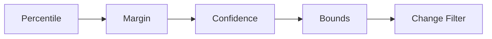

# Core Concepts

## Custom Resource Definitions

kube-rightsize introduces three CRDs:

**RightSizePolicy** (namespaced, short name `rsp`) is the primary resource.
Each policy targets one or more workloads in a namespace, configures the
recommendation parameters, and controls how resizes are applied.

**RightSizeDefaults** (cluster-scoped, short name `rsd`) sets global default
values for metrics source, resource config, and update strategy.

**RightSizeNamespaceDefaults** (namespaced, short name `rsnd`) sets
per-namespace defaults for policies in the same namespace. If a namespace
has a `RightSizeNamespaceDefaults`, the controller uses it instead of the
cluster-scoped `RightSizeDefaults`. Fields omitted there fall back to the
policy's own built-in defaults, not the cluster defaults.

## Update modes

Modes are graduated from safe observation to full automation:

| Mode | Reads metrics | Writes recommendations | Resizes pods |
|------|:---:|:---:|:---:|
| **Observe** | Yes | No (data collection only) | No |
| **Recommend** | Yes | Yes (status only) | No |
| **OneShot** | Yes | Yes | One pod per cycle |
| **Canary** | Yes | Yes | A percentage of pods, then the rest after observation |
| **Auto** | Yes | Yes | All eligible pods |

!!! note "Observe vs Recommend"
    `Observe` collects metrics and tracks data-point progress but does not
    surface recommendations or savings estimates. Use it as a zero-footprint
    warm-up phase. Switch to `Recommend` when you want to see what the
    operator would suggest.

!!! note "Batch workloads (Job / CronJob)"
    Jobs and CronJobs are supported as `targetRef.kind` values. Batch
    workloads are always recommend-only regardless of the mode setting,
    since completed pods cannot be resized in-place. Use the recommendations
    to update your Job/CronJob template for future runs.

!!! warning
    Start with **Recommend** in production. Promote to **Canary** only after
    reviewing recommendations and verifying confidence scores.

## The estimator chain

Recommendations are produced by a chain of composable estimators. Each stage
wraps the previous one:



1. **Percentile** selects the configured percentile (e.g. p95) from 24 hourly
   buckets and takes the maximum across all hours.
2. **Margin** multiplies by a safety factor (e.g. 1.2 for 20% headroom).
3. **Confidence** widens the recommendation when data is sparse.
4. **Bounds** clamps the result to user-defined min/max values.
5. **Change Filter** suppresses changes below 10% and caps changes above the
   configured maximum percentage per cycle.

See [Algorithm](../architecture/algorithm.md) for formulas and details.

## In-Place Pod Resize

Kubernetes 1.33 introduced GA support for in-place pod resize via the
`/resize` subresource. The kubelet adjusts cgroup limits without restarting
the container. kube-rightsize calls `UpdateResize` on each pod, then polls
the container status until the new resources are reported or an `Infeasible`
condition appears.

!!! note "QoS class preservation"
    The operator refuses a resize if it would change the pod's QoS class.
    For Guaranteed pods, requests must always equal limits.

## Safety system

Every resize is guarded by the safety monitor:

- **OOMKill detection**: reverts if the container is OOMKilled after resize.
- **CPU throttle detection**: reverts if the CPU throttle ratio exceeds 50%
  post-resize (queries Prometheus for `container_cpu_cfs_throttled_periods_total`).
- **Restart spike**: reverts if the container restarts 2+ times post-resize.
- **NotReady detection**: reverts if the pod loses its Ready condition.
- **Exponential backoff**: consecutive reverts double the cooldown (capped at 16x).
- **LimitRange/ResourceQuota guard**: skips resizes that would violate
  namespace LimitRange min/max constraints or exceed ResourceQuota headroom.
- **Degraded condition**: when 3+ of the last 5 resizes are reverted, the
  controller sets a `Degraded` condition with reason `HighRevertRate`.
- **Kubernetes Events**: emits `Normal/Resized` and `Warning/Reverted` events
  on the policy for visibility via `kubectl describe`.
- **Auto-revert**: when enabled (default), the operator restores the original
  resources via the `/resize` subresource.

Cooldown enforcement prevents repeated resize attempts. See
[Safety System](../architecture/safety.md) for the full design.

## Cost savings estimation

The operator computes `EstimatedMonthlySavings` based on the difference
between current and recommended resource requests. Pricing is configurable
via `RightSizeDefaults` or `RightSizeNamespaceDefaults`:

```yaml
spec:
  costPricing:
    cpuPerCoreHour: "0.031"     # default: $0.031
    memoryPerGiBHour: "0.004"   # default: $0.004
```

The formula is: `(cpuCoresSaved * cpuPrice + memGiBSaved * memPrice) * 730 hours/month`.
View savings via `kubectl rightsize savings` or the Grafana dashboard.

## Multi-container support

By default, the operator computes recommendations for every container in a pod.
For pods with sidecar containers managed by a service mesh (e.g., `istio-proxy`,
`linkerd-proxy`), use `excludeContainers` to skip them:

```yaml
spec:
  excludeContainers:
    - istio-proxy
```

Before executing a resize, the operator also checks that the total resource
requests across all containers (with the new target applied) do not exceed the
node's allocatable resources.

## Prometheus auto-discovery

The Prometheus address is resolved in order:

1. `spec.metricsSource.prometheus.address` on the RightSizePolicy
2. `spec.metricsSource.prometheus.address` on a RightSizeNamespaceDefaults resource in the same namespace
3. `spec.metricsSource.prometheus.address` on a RightSizeDefaults resource
4. Auto-discovery: Prometheus Operator CRD (`monitoring.coreos.com/v1 Prometheus`)
5. Auto-discovery: well-known service names (`prometheus-server`,
   `prometheus-kube-prometheus-prometheus`) in common namespaces

If all four fail, the policy enters `PrometheusUnavailable` status.

## Conflict detection

The operator detects:

- **VPA conflicts**: warns when a VPA targets the same workload.
- **HPA coexistence**: logs a notice and adjusts only requests (not replicas).
- **Policy overlap**: higher-weight policies take precedence when multiple
  RightSizePolicies match the same workload.
- **Active rollouts**: skips resizing during an in-progress deployment rollout.
- **Opt-out annotation**: workloads with `rightsize.io/skip: "true"` are ignored.
