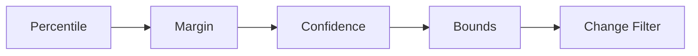

## Custom Resource Definitions

kube-rightsize introduces two CRDs:

**RightSizePolicy** (namespaced, short name `rsp`) is the primary resource.
Each policy targets one or more workloads in a namespace, configures the
recommendation parameters, and controls how resizes are applied.

**RightSizeDefaults** (cluster-scoped, short name `rsd`) sets global default
values for metrics source, resource config, and update strategy. Individual
policies inherit these defaults and can override any field.

## Update modes

Modes are graduated from safe observation to full automation:

| Mode | Reads metrics | Writes recommendations | Resizes pods |
|------|:---:|:---:|:---:|
| **Observe** | Yes | No | No |
| **Recommend** | Yes | Yes (status only) | No |
| **OneShot** | Yes | Yes | One pod per cycle |
| **Canary** | Yes | Yes | A percentage of pods, then the rest after observation |
| **Auto** | Yes | Yes | All eligible pods |

!!! warning
    Start with **Recommend** in production. Promote to **Canary** only after
    reviewing recommendations and verifying confidence scores.

## The estimator chain

Recommendations are produced by a chain of composable estimators. Each stage
wraps the previous one:

1. **Percentile** selects the configured percentile (e.g. p95) from 24 hourly
   buckets and takes the maximum across all hours.
2. **Margin** multiplies by a safety factor (e.g. 1.2 for 20% headroom).
3. **Confidence** widens the recommendation when data is sparse.
4. **Bounds** clamps the result to user-defined min/max values.
5. **Change Filter** suppresses changes below 10% and caps changes above the
   configured maximum percentage per cycle.

See [Algorithm](../architecture/algorithm.md) for formulas and details.

## In-Place Pod Resize

Kubernetes 1.35 introduced GA support for in-place pod resize via the
`/resize` subresource. The kubelet adjusts cgroup limits without restarting
the container. kube-rightsize calls `UpdateResize` on each pod, then polls
the container status until the new resources are reported or an `Infeasible`
condition appears.

!!! note "QoS class preservation"
    The operator refuses a resize if it would change the pod's QoS class.
    For Guaranteed pods, requests must always equal limits.

## Safety system

Every resize is guarded by the safety monitor:

- **OOMKill detection**: reverts if the container is OOMKilled after resize.
- **Restart spike**: reverts if the container restarts 2+ times post-resize.
- **NotReady detection**: reverts if the pod loses its Ready condition.
- **Auto-revert**: when enabled (default), the operator restores the original
  resources via the `/resize` subresource.

Cooldown enforcement prevents repeated resize attempts. See
[Safety System](../architecture/safety.md) for the full design.

## Conflict detection

The operator detects:

- **VPA conflicts**: warns when a VPA targets the same workload.
- **HPA coexistence**: logs a notice and adjusts only requests (not replicas).
- **Policy overlap**: higher-weight policies take precedence when multiple
  RightSizePolicies match the same workload.
- **Active rollouts**: skips resizing during an in-progress deployment rollout.
- **Opt-out annotation**: workloads with `rightsize.io/skip: "true"` are ignored.
