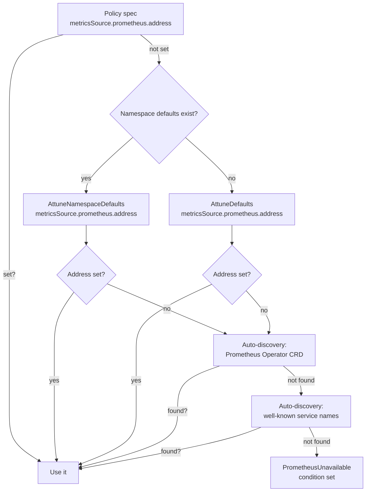

# Prometheus Setup

attune relies on Prometheus for historical CPU and memory usage data.
This guide covers which metrics are required, how to configure the Prometheus
address, and how to verify the integration is working.

## Required Prometheus metrics

The operator queries these metrics, all scraped automatically by cadvisor
(built into the kubelet):

| Metric | Query | What it measures |
|--------|-------|-----------------|
| `container_cpu_usage_seconds_total` | `rate(...[5m])` | CPU cores consumed per container |
| `container_memory_working_set_bytes` | instant | Memory actively used per container |
| `container_cpu_cfs_throttled_periods_total` | `rate(...[5m]) / rate(cfs_periods[5m])` | CPU throttle ratio (safety monitor) |
| `container_cpu_cfs_periods_total` | used in throttle ratio denominator | Total CPU scheduling periods |

The first two metrics are required for recommendations. The CFS throttle
metrics are used by the safety monitor when `autoRevert: true` (default)
to detect CPU under-provisioning after a resize. If these metrics are
missing, throttle detection is silently skipped.

These metrics are available out of the box in any Prometheus installation
that scrapes the kubelet's `/metrics/cadvisor` endpoint. No additional
exporters or recording rules are needed.

!!! note
    The queries filter by `namespace`, `pod` (regex prefix match), and
    `container` name. If your Prometheus relabels these labels, the
    queries will return empty results.

## Prometheus address resolution

The operator resolves the Prometheus address in this order:



### 1. Policy-level address (highest priority)

```yaml
spec:
  metricsSource:
    prometheus:
      address: http://prometheus-server.monitoring:80
```

Use this when different namespaces use different Prometheus instances.

If you configure `metricsSource.prometheus.bearerTokenSecret`, the Secret must live in the same namespace as the `AttunePolicy`. Cross-namespace Secret references are rejected.

!!! warning "Use an in-cluster address"
    The operator validates `metricsSource.prometheus.address` to block
    loopback and cloud metadata endpoints. `http://127.0.0.1:9090`,
    `http://[::1]:9090`, `http://169.254.169.254/...`, and metadata
    hostnames are rejected. Do not point a policy at a local port-forward
    or a workstation URL. Use a Service DNS name or ClusterIP that the
    operator can reach from inside the cluster, such as
    `http://prometheus-server.monitoring:80`. Private cluster IPs are
    allowed.

### 2. Namespace defaults

```yaml
apiVersion: attune.io/v1alpha1
kind: AttuneNamespaceDefaults
metadata:
  name: team-defaults
  namespace: production
spec:
  metricsSource:
    prometheus:
      address: http://prometheus-server.monitoring:80
```

Policies that omit `metricsSource.prometheus.address` inherit from this first.
Use namespace defaults when different teams or environments need different
Prometheus backends.

Because the controller resolves a single defaults source per namespace, a
`AttuneNamespaceDefaults` object shadows cluster defaults for Prometheus
config too. If it exists but omits `metricsSource.prometheus.address`, the
controller falls through to auto-discovery, not to `AttuneDefaults`.

### 3. Cluster-wide defaults

```yaml
apiVersion: attune.io/v1alpha1
kind: AttuneDefaults
metadata:
  name: default
spec:
  metricsSource:
    prometheus:
      address: http://prometheus-server.monitoring:80
```

Policies that omit `metricsSource.prometheus.address` inherit from this when
no `AttuneNamespaceDefaults` exists in the same namespace. This is the
recommended baseline for most clusters.

### 4. Auto-discovery (Prometheus Operator)

If the [Prometheus Operator](https://github.com/prometheus-operator/prometheus-operator)
is installed, attune lists `monitoring.coreos.com/v1 Prometheus`
resources and constructs the address from the first one found:

```
http://prometheus-<name>.<namespace>:<port>
```

No configuration needed. This works with kube-prometheus-stack and any
Prometheus Operator deployment.

### 5. Auto-discovery (well-known services)

As a last resort, the operator checks for services with well-known names
in common namespaces:

| Namespace | Service name |
|-----------|-------------|
| `monitoring` | `prometheus-server` |
| `monitoring` | `prometheus-kube-prometheus-prometheus` |
| `prometheus` | `prometheus-server` |
| `kube-prometheus-stack` | `prometheus-kube-prometheus-prometheus` |

If found, the actual port from the Service spec is used (falls back to 9090
if no ports are defined).

!!! warning "Service port vs process port"
    The Prometheus *process* usually listens on port 9090, but the
    Kubernetes Service may expose a different port (e.g., port 80 in the
    prometheus-community chart). Well-known service auto-discovery uses the
    Service port from the Service spec and only falls back to 9090 when the
    Service declares no ports. Set the address explicitly only if you use a
    non-standard Service name or namespace, or if you want to bypass
    auto-discovery.

## Common Prometheus installations

### prometheus-community/prometheus (Helm)

```bash
helm repo add prometheus-community https://prometheus-community.github.io/helm-charts
helm install prometheus prometheus-community/prometheus \
  --namespace monitoring --create-namespace \
  --set server.persistentVolume.enabled=true
```

The Service is `prometheus-server.monitoring` on **port 80** (not 9090):

```yaml
# AttuneDefaults
spec:
  metricsSource:
    prometheus:
      address: http://prometheus-server.monitoring:80
```

### kube-prometheus-stack (Helm)

```bash
helm repo add prometheus-community https://prometheus-community.github.io/helm-charts
helm install kube-prom prometheus-community/kube-prometheus-stack \
  --namespace monitoring --create-namespace
```

The Service is `prometheus-kube-prometheus-prometheus.monitoring` on
**port 9090**:

```yaml
spec:
  metricsSource:
    prometheus:
      address: http://prometheus-kube-prometheus-prometheus.monitoring:9090
```

Auto-discovery (both Prometheus Operator CRD and well-known service name)
works out of the box with this stack.

### Prometheus Operator (standalone)

If you deploy Prometheus via the Prometheus Operator's `Prometheus` CRD,
auto-discovery finds it automatically. No address configuration needed.

## Verifying the integration

### Step 1: Check the Prometheus Service port

```bash
kubectl get svc -n monitoring prometheus-server
# NAME                TYPE        CLUSTER-IP     PORT(S)
# prometheus-server   ClusterIP   10.96.x.x      80/TCP
```

Use the `PORT(S)` column value, not 9090.

### Step 2: Verify cadvisor metrics exist

```bash
kubectl run prom-check --image=curlimages/curl --restart=Never --rm --attach --command -- \
  curl -s 'http://prometheus-server.monitoring:80/api/v1/query?query=container_cpu_usage_seconds_total' \
  | head -c 200
```

You should see `"status":"success"` with result data. If you see
`"resultType":"vector","result":[]`, cadvisor scraping is not configured.

### Step 3: Test a namespace-scoped query

Replace `<namespace>` and `<pod-prefix>` with a real workload:

```bash
kubectl run prom-check --image=curlimages/curl --restart=Never --rm --attach --command -- \
  curl -s 'http://prometheus-server.monitoring:80/api/v1/query?query=rate(container_cpu_usage_seconds_total{namespace="<namespace>",pod=~"<pod-prefix>.*"}[5m])'
```

Non-empty results confirm attune can query metrics for that workload.

### Step 4: Check policy conditions

```bash
kubectl get rsp -A
```

| Condition | Meaning |
|-----------|---------|
| `Ready: True, Reason: Monitoring` | Prometheus reachable, recommendations computed |
| `Ready: False, Reason: InsufficientData` | Prometheus reachable but not enough history yet |
| `Ready: False, Reason: PrometheusUnavailable` | Prometheus could not be used for this reconcile. Check the condition message and [Troubleshooting](troubleshooting.md#prometheusunavailable) for address, auth/TLS, timeout, or query failures. |

If the condition is `InsufficientData`, wait for enough samples to accumulate.
By default, recommendations need `minimumDataPoints: 48` Prometheus range-query
samples. With the default `queryStep: 5m`, that is about 4 hours of data
within the default `historyWindow: 168h`.

## Operator metrics (what attune exposes)

attune itself exposes Prometheus metrics on its `:8080/metrics`
endpoint. To scrape these, either:

- Enable the Helm chart's **ServiceMonitor** (`metrics.serviceMonitor.enabled: true`), or
- Add a scrape annotation to the operator pod

See [Metrics Reference](../reference/metrics.md) for the full list of
`attune_*` metrics.

## Grafana dashboard

Enable the Helm chart's dashboard ConfigMap to auto-provision a
Grafana dashboard:

```bash
helm upgrade attune oci://ghcr.io/attune-io/charts/attune \
  --set grafanaDashboard.enabled=true
```

The dashboard covers resizes, reverts, savings, recommendations, confidence
scores, reconcile latency, and Prometheus query health. See
[deploy/grafana/dashboard.json](https://github.com/attune-io/attune/blob/main/deploy/grafana/dashboard.json)
for the raw JSON.

## Alerting with PrometheusRule

Enable the Helm chart's PrometheusRule to get out-of-the-box alerts:

```bash
helm upgrade attune oci://ghcr.io/attune-io/charts/attune \
  --set metrics.prometheusRule.enabled=true
```

This creates four alerts:

| Alert | Fires when | Default severity |
|-------|-----------|-----------------|
| `KubeRightsizeReconcileErrors` | Reconcile error rate > 0 sustained for 10m | warning |
| `KubeRightsizePrometheusUnreachable` | Prometheus query errors sustained for 10m | warning |
| `KubeRightsizeDegraded` | More than 3 reverts in 15m for a workload | critical |
| `KubeRightsizeReconcileStale` | No reconcile completes within 30m | warning |

Individual alerts can be disabled or tuned:

```yaml
metrics:
  prometheusRule:
    enabled: true
    rules:
      reconcileErrors:
        severity: critical   # escalate to critical
      degraded:
        enabled: false       # disable this alert
      reconcileStale:
        staleDuration: 1h    # fire after 1 hour instead of 30m
```

See the [Helm chart README](https://github.com/attune-io/attune/blob/main/charts/attune/README.md) for the
full list of configurable parameters.