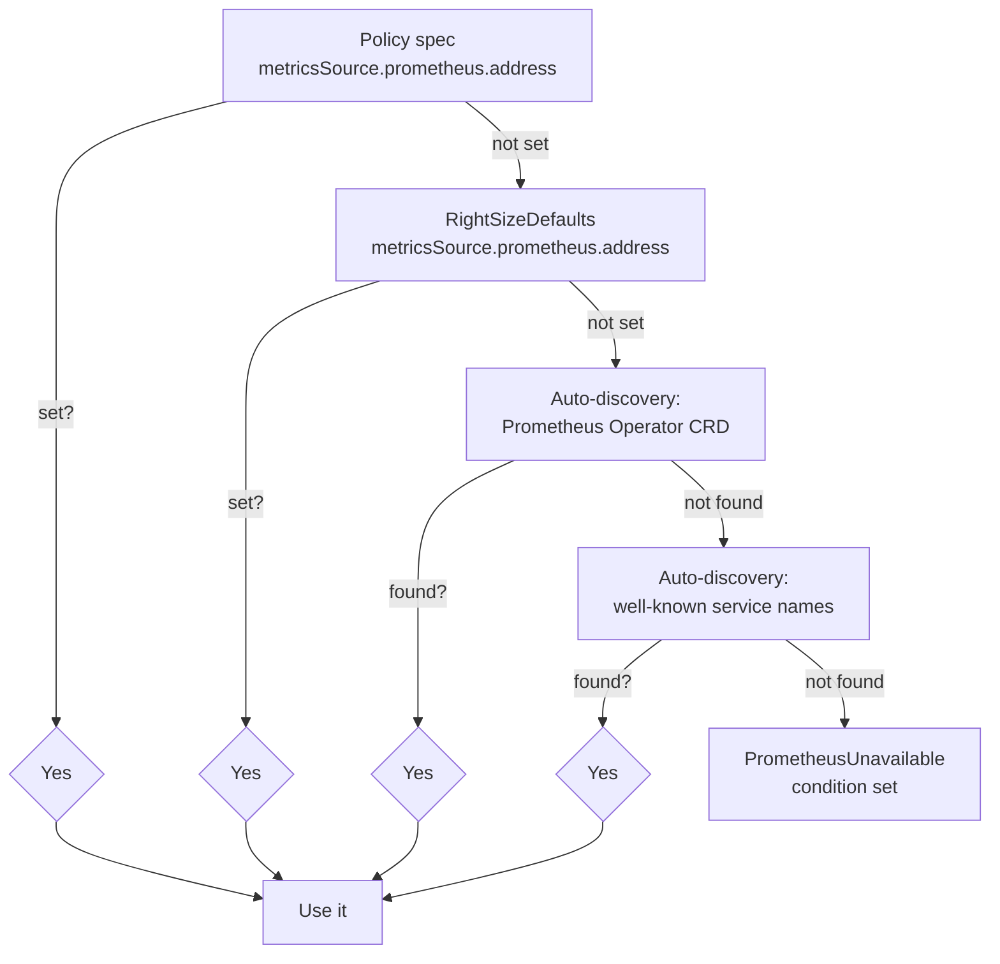

kube-rightsize relies on Prometheus for historical CPU and memory usage data.
This guide covers which metrics are required, how to configure the Prometheus
address, and how to verify the integration is working.

## Required Prometheus metrics

The operator queries these metrics, all scraped automatically by cadvisor
(built into the kubelet):

| Metric | Query | What it measures |
|--------|-------|-----------------|
| `container_cpu_usage_seconds_total` | `rate(...[5m])` | CPU cores consumed per container |
| `container_memory_working_set_bytes` | instant | Memory actively used per container |
| `container_cpu_cfs_throttled_periods_total` | `rate(...[5m]) / rate(cfs_periods[5m])` | CPU throttle ratio (safety monitor) |
| `container_cpu_cfs_periods_total` | used in throttle ratio denominator | Total CPU scheduling periods |

The first two metrics are required for recommendations. The CFS throttle
metrics are used by the safety monitor when `autoRevert: true` (default)
to detect CPU under-provisioning after a resize. If these metrics are
missing, throttle detection is silently skipped.

These metrics are available out of the box in any Prometheus installation
that scrapes the kubelet's `/metrics/cadvisor` endpoint. No additional
exporters or recording rules are needed.

!!! note
    The queries filter by `namespace`, `pod` (regex prefix match), and
    `container` name. If your Prometheus relabels these labels, the
    queries will return empty results.

## Prometheus address resolution

The operator resolves the Prometheus address in this order:



### 1. Policy-level address (highest priority)

```yaml
spec:
  metricsSource:
    prometheus:
      address: http://prometheus-server.monitoring:80
```

Use this when different namespaces use different Prometheus instances.

### 2. Cluster-wide defaults

```yaml
apiVersion: rightsize.io/v1alpha1
kind: RightSizeDefaults
metadata:
  name: default
spec:
  metricsSource:
    prometheus:
      address: http://prometheus-server.monitoring:80
```

Policies that omit `metricsSource.prometheus.address` inherit from this.
This is the recommended approach for most clusters.

### 3. Auto-discovery (Prometheus Operator)

If the [Prometheus Operator](https://github.com/prometheus-operator/prometheus-operator)
is installed, kube-rightsize lists `monitoring.coreos.com/v1 Prometheus`
resources and constructs the address from the first one found:

```
http://prometheus-<name>.<namespace>:<port>
```

No configuration needed. This works with kube-prometheus-stack and any
Prometheus Operator deployment.

### 4. Auto-discovery (well-known services)

As a last resort, the operator checks for services with well-known names
in common namespaces:

| Namespace | Service name |
|-----------|-------------|
| `monitoring` | `prometheus-server` |
| `monitoring` | `prometheus-kube-prometheus-prometheus` |
| `prometheus` | `prometheus-server` |
| `kube-prometheus-stack` | `prometheus-kube-prometheus-prometheus` |

If found, port 9090 is assumed.

!!! warning "Service port vs process port"
    The Prometheus *process* listens on port 9090, but the Helm chart's
    Kubernetes Service may expose a different port (e.g., port 80 in the
    prometheus-community chart). Auto-discovery uses port 9090; if your
    Service uses a different port, set the address explicitly in a
    `RightSizeDefaults` resource.

## Common Prometheus installations

### prometheus-community/prometheus (Helm)

```bash
helm repo add prometheus-community https://prometheus-community.github.io/helm-charts
helm install prometheus prometheus-community/prometheus \
  --namespace monitoring --create-namespace \
  --set server.persistentVolume.enabled=true
```

The Service is `prometheus-server.monitoring` on **port 80** (not 9090):

```yaml
# RightSizeDefaults
spec:
  metricsSource:
    prometheus:
      address: http://prometheus-server.monitoring:80
```

### kube-prometheus-stack (Helm)

```bash
helm repo add prometheus-community https://prometheus-community.github.io/helm-charts
helm install kube-prom prometheus-community/kube-prometheus-stack \
  --namespace monitoring --create-namespace
```

The Service is `prometheus-kube-prometheus-prometheus.monitoring` on
**port 9090**:

```yaml
spec:
  metricsSource:
    prometheus:
      address: http://prometheus-kube-prometheus-prometheus.monitoring:9090
```

Auto-discovery (both Prometheus Operator CRD and well-known service name)
works out of the box with this stack.

### Prometheus Operator (standalone)

If you deploy Prometheus via the Prometheus Operator's `Prometheus` CRD,
auto-discovery finds it automatically. No address configuration needed.

## Verifying the integration

### Step 1: Check the Prometheus Service port

```bash
kubectl get svc -n monitoring prometheus-server
# NAME                TYPE        CLUSTER-IP     PORT(S)
# prometheus-server   ClusterIP   10.96.x.x      80/TCP
```

Use the `PORT(S)` column value, not 9090.

### Step 2: Verify cadvisor metrics exist

```bash
kubectl run prom-check --image=curlimages/curl --restart=Never --rm -it -- \
  curl -s 'http://prometheus-server.monitoring:80/api/v1/query?query=container_cpu_usage_seconds_total' \
  | head -c 200
```

You should see `"status":"success"` with result data. If you see
`"resultType":"vector","result":[]`, cadvisor scraping is not configured.

### Step 3: Test a namespace-scoped query

Replace `<namespace>` and `<pod-prefix>` with a real workload:

```bash
kubectl run prom-check --image=curlimages/curl --restart=Never --rm -it -- \
  curl -s 'http://prometheus-server.monitoring:80/api/v1/query?query=rate(container_cpu_usage_seconds_total{namespace="<namespace>",pod=~"<pod-prefix>.*"}[5m])'
```

Non-empty results confirm kube-rightsize can query metrics for that workload.

### Step 4: Check policy conditions

```bash
kubectl get rsp -A
```

| Condition | Meaning |
|-----------|---------|
| `Ready: True, Reason: Monitoring` | Prometheus reachable, recommendations computed |
| `Ready: False, Reason: InsufficientData` | Prometheus reachable but not enough history yet |
| `Ready: False, Reason: PrometheusUnavailable` | No Prometheus address found (check resolution chain above) |

If the condition is `InsufficientData`, wait for the `historyWindow` period
(default 7 days) to accumulate enough data points (default 168).

## Operator metrics (what kube-rightsize exposes)

kube-rightsize itself exposes Prometheus metrics on its `:8080/metrics`
endpoint. To scrape these, either:

- Enable the Helm chart's **ServiceMonitor** (`metrics.serviceMonitor.enabled: true`), or
- Add a scrape annotation to the operator pod

See [Metrics Reference](../reference/metrics.md) for the full list of
`kube_rightsize_*` metrics.

## Grafana dashboard

Enable the Helm chart's dashboard ConfigMap to auto-provision a
Grafana dashboard:

```bash
helm upgrade kube-rightsize oci://ghcr.io/sebtardif/charts/kube-rightsize \
  --set grafanaDashboard.enabled=true
```

The dashboard covers resizes, reverts, savings, recommendations, confidence
scores, reconcile latency, and Prometheus query health. See
[deploy/grafana/dashboard.json](https://github.com/SebTardif/kube-rightsize/blob/main/deploy/grafana/dashboard.json)
for the raw JSON.